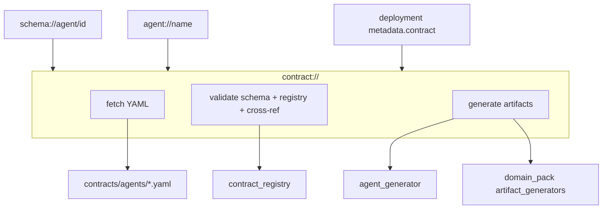

# Kontrakty agentów

## Minimalny kontrakt

```yaml
agent:
  name: user-agent
  python_package: user_agent
  version: 0.1.0
  description: Thin generated agent for users.
  runtime_url_env: RESOURCE_RUNTIME_URL
  runtime_url_default: http://localhost:8000

capabilities:
  - name: read_user
    type: resource_read
    uri: resource://users/{user_id}
    output_schema: app.users.v1.UserView
    renderer: detail

  - name: create_user
    type: command
    command: CreateUser
    input_schema: app.users.v1.CreateUserCommand
    emits:
      - UserCreated
```

## Capability: resource_read

Służy do odczytu danych z Resource Runtime przez URI.

```yaml
- name: read_user_roles
  type: resource_read
  uri: resource://users/{user_id}/roles
  output_schema: app.users.v1.UserRolesView
  renderer: table
```

## Capability: command

Służy do wysyłania komend do Resource Runtime.

```yaml
- name: assign_user_role
  type: command
  command: AssignUserRole
  input_schema: app.users.v1.AssignUserRoleCommand
  emits:
    - UserRoleAssigned
```

## Dobre praktyki

- Nazwa capability powinna być stabilna.
- URI powinno być semantyczne, nie techniczne.
- Nie wiąż URI z nazwą tabeli SQL.
- Capability powinno mieć test kontraktowy.
- Breaking change wymaga nowej wersji capability albo nowego URI.


Tak — **`contract://` jest zaimplementowane** (Faza A MVP). Callable URI do kontraktu źródłowego i walidacji przed deployem. Szczegóły: [`TUTORIAL_AGENT_SCHEMA_URI.md`](docs/TUTORIAL_AGENT_SCHEMA_URI.md).

Dziś kontrakt agenta docierasz pośrednio:

| Cel | Dziś |
|-----|------|
| Pełny obraz (card + contract + deployment) | `schema://agent/{deployment_id}` |
| Surowy YAML | `file://…/contracts/agents/{agent}.yaml` |
| Walidacja | `python -m hypervisor.contract_registry.cli check` |
| Generacja kodu | `make generate`, `uri agent generate`, `agent-factory://…` |

`schema://` **agreguje** runtime + kontrakt. Brakuje **kanonicznego, callable URI** do samego kontraktu: pobrania, walidacji i generowania artefaktów.

---

## Propozycja: `contract://` jako warstwa „source of truth”



### Gramatyka URI (faza 1)

```text
contract://agent/{agent_name}                 # np. weather-map-agent (logiczny ref)
contract://deployment/{deployment_id}         # np. weather-map-agent.local
contract://agents/{slug}                      # np. user_agent → contracts/agents/user_agent.yaml
contract://registry                           # output/contract_registry.resolved.json
contract://registry/validate                  # pełny check (schema + registry + cross-ref)
contract://agent/{name}/validate            # walidacja jednego kontraktu
contract://agent/{name}/generate            # regeneracja agents/generated/*
contract://agent/{name}/artifacts           # manifest powiązanych artefaktów
```

Query params (jak w innych scheme):

```text
contract://agent/weather-map-agent?format=yaml|json|envelope
contract://registry/validate?level=schema|registry|cross|all
contract://agent/user-agent/generate?dry_run=1&overwrite=0
```

---

## Operacje

### 1. Fetch — pobranie kontraktu

```bash
uri call contract://agent/weather-map-agent
uri call contract://deployment/weather-map-agent.local
uri explain contract://agents/user_agent
```

Envelope (zgodny z [`ARTIFACT_STANDARD.md`](docs/ARTIFACT_STANDARD.md)):

```yaml
kind: AgentContract
uri:
  self: contract://agent/weather-map-agent
  source: file:///…/contracts/agents/weather_map_agent.yaml
  agent: agent://weather-map-agent
  deployment: hypervisor://local/weather-map-agent.local
spec:
  # parsed YAML (agent, capabilities, …)
status:
  contract_hash: sha256:…
  schema_valid: true
  registry_valid: true
```

**Różnica vs `schema://`:** `contract://` = plik źródłowy + walidacja; `schema://` = card + deployment + merge runtime/contract.

### 2. Validate — sprawdzenie kontraktu

Delegacja do istniejącego stacku (`hypervisor.contract_registry`):

```bash
uri call contract://registry/validate
uri call contract://agent/schema-collab-agent/validate
```

Wynik:

```yaml
kind: ContractValidationReport
status:
  ok: true
  schema_errors: []
  registry_errors: []
  cross_ref_errors: []
  capabilities_checked: 12
```

Bez nowej logiki walidacji — tylko opakowanie CLI/doctor w URI.

### 3. Generate — command/query → artefakty

Trzy poziomy generacji, które już macie, spięte jednym URI:

| URI | Co robi | Istniejący backend |
|-----|---------|-------------------|
| `contract://agent/{id}/generate` | Pakiet HTTP agenta | `generator.agent_generator` |
| `contract://domain/{domain}/artifacts` | commands, resources, views, proto | `domain_pack/artifact_generators/*` |
| `contract://agent/{id}/capabilities` | Manifest touri (query/command) | most do `*.uri.capability.yaml` |

Przykład dla capability typu **command** z kontraktu:

```yaml
# contracts/agents/user_agent.yaml
- name: create_user
  type: command
  command: CreateUser
  input_schema: app.users.v1.CreateUserCommand
  emits: [UserCreated]
```

→ artefakty:

```text
command://users/create          # handler + envelope
proto: app.users.v1.*            # schematy
agents/generated/user_agent/    # kod agenta
examples/20_touri_capabilities/user_agent.uri.capability.yaml
```

```bash
uri call contract://agent/user-agent/generate?dry_run=1
uri call contract://agent/user-agent/artifacts?kinds=command,proto,agent
```

---

## Mapowanie command / query

W kontrakcie macie dziś głównie:

- `resource_read` → query (MCP-style read przez `resource://`)
- `command` → mutacja + `emits`

Propozycja w `contract://`:

```text
contract://agent/{id}/capability/{name}           # meta capability
contract://agent/{id}/capability/{name}/schema    # input/output proto refs
contract://agent/{id}/capability/{name}/invoke    # dry-run plan (nie runtime HTTP)
```

To nie zastępuje `curl …/skills/…`, tylko daje **plan wywołania + schemat + oczekiwany artefakt** — spójne z touri `kind: query|command|artifact`.

---

## Gdzie podpiąć w kodzie (minimalny diff)

| Plik | Zmiana |
|------|--------|
| `hypervisor_dashboard_agent/uri_client.py` | `_handle_contract_uri`, reuse `_contract_path_for_agent` |
| `urish/backends/call.py` | dodać `"contract"` do `_SYSTEM_URI_SCHEMES` |
| `uri3/protocols/schemes/` | spec + rejestracja scheme |
| `hypervisor/contract_registry/resolver.py` | **nowy** — centralna resolucja agent/deployment/slug |
| `deployments/agent_deployments.yaml` | opcjonalnie `metadata.contract_uri: contract://agent/…` |
| `docs/TUTORIAL_AGENT_SCHEMA_URI.md` | zamiana „not available” → cookbook |

`schema://` może zwracać:

```json
"related_uris": {
  "contract": "contract://agent/weather-map-agent",
  "contract_source": "file://…"
}
```

---

## Fazy wdrożenia

**Faza A (MVP, ~1 PR)**  
- `contract://agent/{name}` fetch  
- `contract://registry/validate`  
- `contract://agent/{name}/validate`  
- testy + aktualizacja tutoriala  

**Faza B**  
- `…/generate`, `…/artifacts`  
- envelope + hash w odpowiedzi  

**Faza C**  
- `capability/{name}/schema|invoke`  
- most do touri manifests  
- integracja z Chat NL (*„pokaż kontrakt agenta X”* → `contract://…`)

---

## Przykładowy flow (docelowy)

```bash
# 1. Pobierz i sprawdź kontrakt
uri call contract://agent/screenshot-analysis-agent
uri call contract://agent/screenshot-analysis-agent/validate

# 2. Wygeneruj artefakty z kontraktu
uri call contract://agent/screenshot-analysis-agent/generate --approve

# 3. Pełny obraz runtime + kontrakt
uri call schema://agent/screenshot-analysis-agent.local

# 4. Wywołaj capability (runtime)
curl -s http://localhost:8134/skills/capture_and_analyze -d '{…}'
```
