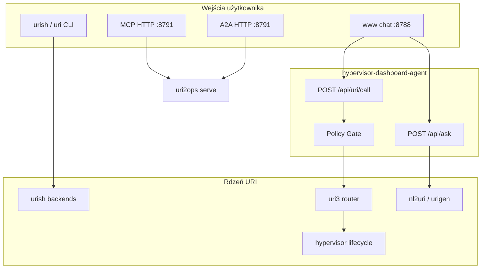

## Analiza systemu agentowego Hypervisor (v0.5.22)

Na podstawie logów `goal -au`, `make start/www-smoke` i logów kontenera `hypervisor-www-chat`.

---

### Stan systemu (z logów)

| Obszar | Wynik |
|--------|--------|
| Testy CI | **506 passed**, 6 skipped — system stabilny |
| Publikacja | **0.5.21 → 0.5.22** na PyPI, tagi git OK |
| Docker chat | `make start` + `make www-smoke` — **OK** |
| Health | `GET /health` → `ok: true`, agent `hypervisor-dashboard` |
| `/api/ask` | Działa — zwraca markdown z planem URI i `next_steps` |
| Błąd w logach | `POST /api/uri/call` → **500** przy repair weather agent |

**Kluczowy błąd historyczny (naprawiony w compose):**

```
FileNotFoundError: Generated agent path not found: /app/agents/generated/weather_map_agent
```

Wcześniejszy obraz montował tylko `www/`. Obecnie `www/docker-compose.yml` montuje też
`packages/`, `agents/generated/`, `deployments/`, `output/` — repair/run z UI powinny
działać po `make start` z hostowego repo.

Pozostałe luki: port rebound (8101/8103 zajęte), brak `uvicorn` w venv, flow YAML ze
sztywnym portem vs effective health URI — zobacz [`CHAT_AND_WORKFLOWS.md`](./CHAT_AND_WORKFLOWS.md).

---

### Jak działa system (architektura)



**Przepływ w czacie (`www/`):**

1. Użytkownik pisze NL (lub klika kartę biurową) → `POST /api/ask` → `urish ask` → plan URI + `next_steps` w markdown.
2. **Chat nie wykonuje workflow automatycznie** — użytkownik uruchamia `uri run …` lub klika Run URI.
3. Wielolinijkowy prompt (jedna komenda na linię) → batch: `Detected N commands`.
4. Klik URI / dry-run → `POST /api/uri/call` → policy gate → wykonanie (view, repair, workflow, …).
5. Domyślnie **dry-run** — mutacje wymagają `approved: true` / `--approve`.

Pełny opis: [`CHAT_AND_WORKFLOWS.md`](./CHAT_AND_WORKFLOWS.md)

**Rdzeń:** wszystko kręci się wokół **URI** jako języka operacji (`repair://`, `view://`, `workflow://`, `browser://`, …).

---

### Jak używać systemu (praktyczny przewodnik)

#### 1. Chat (najprostsze)

```bash
make start                    # http://localhost:8788/www/
```

- Wpisz: `stwórz dashboard agenta hypervisor` → dostaniesz plan + komendy.
- Zostaw **dry-run** włączony, dopóki nie rozumiesz co robi URI.
- Przy mutacjach (repair, run) — najpierw preview, potem approve.

#### 2. CLI (pełna moc)

```bash
uri ask "stwórz agenta pogodowego z healthcheckiem"
uri doctor --strict
uri agent status weather-map-agent.local
uri repair diagnose weather-map-agent.local
uri ecosystem plan "..." --profile dashboard-agent --out output/proposals/...
```

Golden path: `bash examples/30_golden_path/run.sh`

#### 3. Tworzenie agenta od zera

```bash
nl2a -p "generuj mape pogody..."          # → agents/generated/
hypervisor run-agent weather-map-agent.local --detach --wait-healthy
uri3 scan http://localhost:8101           # discovery
```

#### 4. Dashboard systemowy (HTML, nie chat)

- http://localhost:8788/ui/agents — lista deploymentów
- http://localhost:8788/.well-known/agent-card.json — karta agenta

---

### MCP i A2A — czy jest dostępne?

**Tak, ale w różnych warstwach:**

| Warstwa | MCP | A2A | Port | Uwagi |
|---------|-----|-----|------|-------|
| **uri2ops serve** | ✅ `GET/POST /mcp/tools*` | ✅ `POST /a2a/tasks` + agent-card | **8791** | Główny punkt protokołów |
| **hypervisor-dashboard** (`:8788`) | ❌ brak `/mcp/*` | ⚠️ częściowo | 8788 | Tylko `/.well-known/agent-card.json`, bez `/a2a/tasks` |
| **Wygenerowani agenci** (np. weather) | ❌ | ⚠️ agent-card + REST | 8101 | `/health`, `/commands`, nie pełne A2A tasks |
| **uri2run (klient)** | ✅ `mcp://host:8791` | ✅ `a2a://host:8791` | — | Transporty do zdalnych serwerów |

**Uruchomienie MCP/A2A (operator):**

```bash
uri2ops serve --host 127.0.0.1 --port 8791

# MCP
curl http://127.0.0.1:8791/mcp/tools
curl -X POST http://127.0.0.1:8791/mcp/tools/call \
  -H 'Content-Type: application/json' \
  -d '{"name":"browser_open","arguments":{"uri":"browser://chrome/page/open","payload":{"url":"..."},"approve":true,"adapter":"mock"}}'

# A2A
curl http://127.0.0.1:8791/.well-known/agent-card.json
curl -X POST http://127.0.0.1:8791/a2a/tasks -H 'Content-Type: application/json' -d '{...}'
```

**Podłączenie z Cursor / innego klienta MCP:**  
MCP jest **HTTP wrapper** (nie stdio). Trzeba wskazać URL `http://127.0.0.1:8791/mcp/tools` — to nie jest natywny MCP stdio server jak w wielu IDE.

---

### Co wymaga poprawy (priorytety)

#### Krytyczne (widoczne w logach)

1. **Docker bez `agents/generated/`**  
   Repair/run z chatu pada na `weather_map_agent`.  
   Fix: dodać volume `../agents/generated:/app/agents/generated:ro` albo graceful error w UI zamiast 500.

2. **`POST /api/uri/call` → 500 zamiast czytelnego błędu**  
   UI powinno dostać envelope typu „agent nie istnieje w kontenerze” + sugestia `uri ecosystem generate`.

#### Ważne (UX / operacje)

3. **Orphan containers** (`redsl-www`, `redsl-db`, `redsl-api`)  
   `make stop` z `--remove-orphans` albo osobny `make clean`.

4. **Wersja w health vs repo**  
   Health zwraca `version: 0.1.0`, repo ma `0.5.22` — mylące przy debugowaniu.

5. **Chat nie uruchamia `uri2ops serve`**  
   MCP/A2A wymagają osobnego procesu na `:8791` — brak tego w `make start`.

6. **Brak streaming w www chat**  
   `/api/ask` jest synchroniczne; długie plany LLM mogą timeoutować w UI.

#### Nice-to-have

7. **Jedna „golden path” strona w www** — przycisk „uruchom przykład 30” zamiast ręcznych URI.
8. **Integracja MCP stdio** — dla natywnej obsługi w Cursor bez HTTP bridge.
9. **Dashboard A2A endpoint** — `POST /a2a/tasks` na `:8788` dla spójności z uri2ops.

---

### Rekomendowany workflow dla Ciebie

```bash
# 1. Obserwacja (read-only)
make start
# Otwórz http://localhost:8788/www/
# Zapytaj: "stwórz dashboard agenta hypervisor" (dry-run)

# 2. Diagnostyka
uri doctor --strict
uri agent status weather-map-agent.local || true

# 3. Jeśli chcesz repair/run z hosta (nie z Dockera):
hypervisor run-agent weather-map-agent.local --detach --wait-healthy

# 4. Jeśli chcesz MCP/A2A dla operatorów (browser, android):
uri2ops serve --port 8791
```

---

### Podsumowanie

System **działa i jest gotowy do użycia** w trybie obserwacji i planowania NL (chat + CLI). Testy przechodzą, smoke OK. Główna luka to **Docker chat bez pełnego repo agentów** — mutacje (repair, run) z UI padają. **MCP i A2A są dostępne przez `uri2ops serve`**, nie przez sam chat na `:8788`.

Jeśli chcesz, mogę od razu:
- dodać volume `agents/generated` do `docker-compose.yml` i lepszy error handling w `/api/uri/call`, albo
- rozszerzyć `make start` o opcjonalny `uri2ops serve` na `:8791` z dokumentacją MCP/A2A w `www/README.md`.