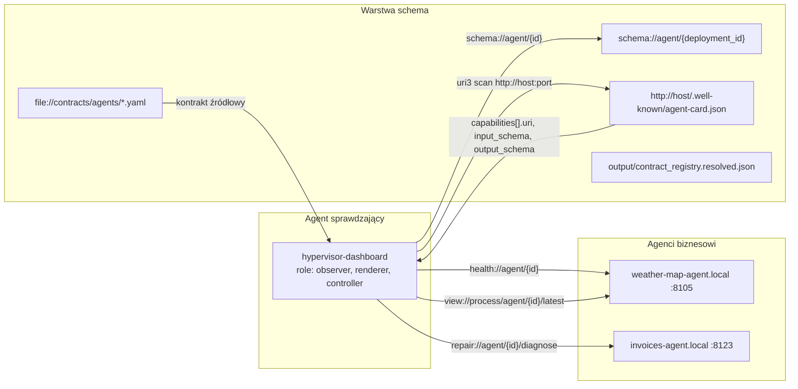

# Tutorial: agent sprawdzający innych agentów — schema, URI, krok po kroku

Przewodnik pokazuje, jak **agent-obserwator** (`hypervisor-dashboard`) uruchamia flotę, **pozyskuje schematy** innych agentów przez URI i **„rozmawia” z nimi** — wywołując capability opisane w agent-card / kontrakcie.

Wersja EN: [`TUTORIAL_AGENT_SCHEMA_URI.md`](./TUTORIAL_AGENT_SCHEMA_URI.md)

Powiązane: [`TUTORIAL_THREE_AGENTS.pl.md`](./TUTORIAL_THREE_AGENTS.pl.md), [`URI_COOKBOOK.md`](./URI_COOKBOOK.md), [`AGENTS_AND_MONITORING.md`](./AGENTS_AND_MONITORING.md)

---

## Architektura (kto z kim rozmawia)



**Agent sprawdzający** w tym repo to **`hypervisor-dashboard`** (`agent://hypervisor-dashboard`, deployment `hypervisor-dashboard.local`). Nie ma osobnego „supervisor-agent” HTTP — flota + schema discovery idzie przez dashboard + hypervisor CLI + system URIs.

---

## Czy da się pozyskać schema konkretnego agenta przez URI?

**Tak.** Najprostsza ścieżka runtime to `schema://agent/{deployment_id}`. Zwraca jeden envelope z danymi deploymentu, runtime card, kontraktem YAML, listą capability oraz referencjami `input_schema` / `output_schema`.

| Co chcesz | URI / komenda | Uwagi |
|-----------|---------------|--------|
| **Zagregowana schema agenta** | `uri call schema://agent/{deployment_id}` | Card runtime + kontrakt YAML + capabilities + schema refs |
| **Runtime agent-card** (capabilities + `input_schema` / `output_schema`) | `http://localhost:{port}/.well-known/agent-card.json` | Najpełniejszy opis tego, co agent *teraz* oferuje |
| **Skan endpointów** (health, card, capabilities) | `uri3 scan http://localhost:{port}` | Odkrywa URIs do dalszych wywołań |
| **Kontrakt źródłowy (callable)** | `uri call contract://agent/{agent_name}` | YAML + capabilities; walidacja: `…/validate` |
| **Walidacja rejestru** | `uri call contract://registry/validate` | schema + registry + cross-ref |
| **Generacja pakietu agenta (dry-run)** | `uri call contract://agent/{agent_name}/generate?dry_run=1` | plan plików + hash kontraktu |
| **Generacja pakietu agenta** | `uri call contract://agent/{agent_name}/generate` | `agents/generated/*` |
| **Manifest artefaktów** | `uri call contract://agent/{agent_name}/artifacts` | kontrakt, agent, proto, deployment |
| **Kontrakt źródłowy YAML (file)** | `file://{repo}/contracts/agents/{agent}.yaml` | `uri3 resolve file://…` |
| **Wygenerowany README (markpact)** | `file://{repo}/agents/generated/{agent}/README.md` | Bloki `markpact:capability`, `markpact:agent_generation` |
| **Protobuf message schema** | `file://{repo}/contracts/proto/*.proto` | Po `output_schema: app.weather.v1.WeatherMapHtmlView` |
| **Inspekcja floty + card w JSON** | `hypervisor inspect-agent {deployment_id}` | Card w `card.payload` |
| **Diagnostyka (card + runtime)** | `uri call repair://agent/{id}/diagnose` | Typ `diagnosis`, renderer JSON |
| **Health check** | `uri call health://agent/{id}` | Lekki probe |
| **Widok procesu (HTML)** | `uri call view://process/agent/{id}/latest` | `dashboard.v1.ProcessView` |
| **Rejestr kontraktów (export)** | `make registry-build` → `output/contract_registry.resolved.json` | Statyczny, nie URI runtime |

**Czego jeszcze nie ma:**

- Brak callable `readiness://agent/{id}`.
- `uri call http://…` **nie** ma backendu HTTP — card pobieraj przez `curl`, `uri3 scan`, albo `inspect-agent` / `repair diagnose`.
- `agent://weather-map-agent` to **referencja logiczna** (metadata), nie fetch card.

---

## Scenariusz zweryfikowany: NL → nowy agent → file/device/robot/cron

Ten scenariusz pokazuje realny lifecycle nowego agenta wygenerowanego z języka naturalnego. Nie używa `urish ecosystem` ani gotowego profilu — wejściem jest prompt NL, a `urish agent generate` opakowuje `resource-agent-factory`.

```bash
uri agent generate \
  "stworz nowego agenta schema-collab-agent, ktory czyta file:// README, sprawdza device://device/sensor-1/status i robot://robot/amr-1/state oraz ma komende cron monitor" \
  --name schema-collab-agent \
  --approve \
  --overwrite \
  --json
```

Powstają:

| Artefakt | Ścieżka / URI |
|----------|----------------|
| Kontrakt | `contracts/agents/schema_collab_agent.yaml` |
| Pakiet agenta | `agents/generated/schema_collab_agent/` |
| Deployment | `schema-collab-agent.local` |
| Agent ref | `agent://schema-collab-agent` |
| Health | `http://localhost:8131/health` |

Wygenerowany kontrakt zawiera capability:

| Capability | URI | Rola |
|------------|-----|------|
| `read_markpact_source` | `file://agents/generated/schema_collab_agent/README.md` | Odczyt pliku/provenance |
| `read_device_status` | `device://device/sensor-1/status` | Odczyt statusu urządzenia przez `uri2ops` |
| `read_robot_state` | `robot://robot/amr-1/state` | Odczyt stanu robota przez `uri2ops` |
| `run_cron_monitor` | `cron://www/monitor/landing` | Planowana/scheduled akcja monitoringu |

Uruchom dwa współpracujące agenty oraz agenta-obserwatora:

```bash
hypervisor run-agent device-robot-operator.local --detach --wait-healthy
hypervisor run-agent schema-collab-agent.local --detach --wait-healthy
hypervisor run-agent hypervisor-dashboard.local --detach --wait-healthy --if-running reuse
```

Logika współpracy:

```text
schema-collab-agent
  → czyta własny README przez file://
  → pyta device-robot-operator o device://device/sensor-1/status
  → pyta device-robot-operator o robot://robot/amr-1/state
  → planuje monitor przez cron://www/monitor/landing

hypervisor-dashboard
  → sprawdza health://agent/...
  → pobiera schema://agent/...
  → wykonuje repair://agent/.../diagnose
  → renderuje view://process/agent/.../latest
```

Minimalna weryfikacja:

```bash
uri call schema://agent/schema-collab-agent.local --json
uri call schema://agent/device-robot-operator.local --json
uri call health://agent/schema-collab-agent.local --json
uri call view://process/agent/schema-collab-agent.local/latest --json

curl -s http://localhost:8131/skills/read_markpact_source | python3 -m json.tool
curl -s http://localhost:8131/skills/read_device_status | python3 -m json.tool
curl -s http://localhost:8131/skills/read_robot_state | python3 -m json.tool
curl -s -X POST http://localhost:8131/skills/run_cron_monitor \
  -H 'Content-Type: application/json' \
  -d '{"dry_run": true}' | python3 -m json.tool
```

W czacie (`http://localhost:8788/www/chat.html`) używaj tych samych URI:

```text
schema://agent/schema-collab-agent.local
file:///app/contracts/agents/schema_collab_agent.yaml
health://agent/schema-collab-agent.local
repair://agent/schema-collab-agent.local/diagnose
view://process/agent/schema-collab-agent.local/latest
```

Uwaga o `file://`: w CLI na hoście zobaczysz ścieżki typu `file:///home/tom/github/wronai/hypervisor/...`, a w kontenerze czatu `file:///app/...`. Używaj `contract_uri` zwróconego przez `schema://agent/...`, bo jest poprawny dla bieżącego runtime.

---

## Krok 0 — Prerequisites

```bash
cd hypervisor
pip install -e '.[dev]'    # uvicorn dla run-agent
make ensure-dev
uri doctor
hypervisor deployments
```

---

## Krok 1 — Uruchom agenta sprawdzającego (dashboard)

Dashboard = observer + chat + API URI.

```bash
make start
# albo:
hypervisor run-agent hypervisor-dashboard.local --detach --wait-healthy --if-running reuse
```

Sprawdź:

```bash
curl -s http://localhost:8788/health | python3 -m json.tool
curl -s http://localhost:8788/api/agents | python3 -m json.tool
```

Chat: http://localhost:8788/www/chat.html

**Co robi ten krok (URI):**

| Akcja | URI / endpoint |
|-------|----------------|
| Start procesu | `hypervisor://local/hypervisor-dashboard.local/run` (przez `hypervisor run-agent`) |
| Health dashboardu | `http://localhost:8788/health` |
| Lista floty | `GET /api/agents` → każdy wpis ma `health_uri`, `view_uri` |

---

## Krok 2 — Uruchom agentów docelowych (biznesowych)

```bash
hypervisor run-agent weather-map-agent.local --detach --wait-healthy --if-running reuse
hypervisor run-agent invoices-agent.local --detach --wait-healthy --if-running reuse
make agent-health
```

Port weather może **rebound** (np. 8101 → 8105). Zawsze sprawdzaj:

```bash
hypervisor inspect-agent weather-map-agent.local | jq '.readiness.effective_health_uri'
```

**Co robi ten krok:**

| Agent | Efektywny health | Agent-card |
|-------|------------------|------------|
| weather-map-agent.local | `http://localhost:8105/health` | `http://localhost:8105/.well-known/agent-card.json` |
| invoices-agent.local | `http://localhost:8123/health` | `http://localhost:8123/.well-known/agent-card.json` |

---

## Krok 3 — Odkryj schema agenta (3 ścieżki)

### 3a. HTTP agent-card (runtime)

Najpierw możesz użyć zagregowanego URI:

```bash
uri call schema://agent/weather-map-agent.local --json
uri call schema://agent/invoices-agent.local --json
uri call schema://agent/schema-collab-agent.local --json
```

Wynik ma `result_type: agent_schema`, `contract_uri`, `card_uri`, `capabilities[]` oraz `schemas.input[]` / `schemas.output[]`.

Uwaga: `uri call --json` opakowuje wynik systemowego URI w standardowy envelope, więc te pola są pod `data.*`. Dashboard API może zwrócić ten sam payload bezpośrednio lub również pod `data`, zależnie od endpointu.

```bash
# skan — jakie endpointy istnieją
uri3 scan http://localhost:8105

# pełna karta
curl -s http://localhost:8105/.well-known/agent-card.json | python3 -m json.tool
curl -s http://localhost:8123/.well-known/agent-card.json | python3 -m json.tool
```

Przykład capability w karcie weather:

```json
{
  "name": "read_weather_map",
  "type": "resource_read",
  "uri": "resource://weather/maps/{place}/forecast/{days}",
  "output_schema": "app.weather.v1.WeatherMapHtmlView",
  "renderer": "html"
}
```

Agent-obserwator czyta to i wie: *mogę wywołać resource URI z parametrami `{place}`, `{days}`; wynik ma typ protobuf `WeatherMapHtmlView`*.

### 3b. Kontrakt źródłowy (`file://`)

```bash
uri3 resolve "file://$(pwd)/contracts/agents/weather_map_agent.yaml"
uri3 resolve "file://$(pwd)/contracts/agents/invoices_agent.yaml"
uri3 resolve "file://$(pwd)/agents/generated/weather_map_agent/README.md"
```

**`file://`** daje dostęp do plików kontraktu, README z markpact, task graphów, itd. — bez HTTP agenta.

### 3c. Inspekcja przez hypervisor (card + readiness)

```bash
hypervisor inspect-agent weather-map-agent.local
hypervisor inspect-agent invoices-agent.local
```

W JSON: `card.payload.capabilities[]`, `agent_readiness`, `effective_health_uri`, log URIs.

---

## Krok 4 — Agent sprawdzający „rozmawia” przez system URIs

Dashboard / `uri call` obsługuje **typed system URIs** (nie surowe `http://`):

```bash
# 1) Health — czy agent żyje
uri call health://agent/weather-map-agent.local
uri call health://agent/invoices-agent.local

# 2) Diagnose — pełna inspekcja + card w inspection
uri call repair://agent/weather-map-agent.local/diagnose
uri call repair://agent/invoices-agent.local/diagnose

# 3) Process view — HTML z linkami do log:// i repair://
uri call view://process/agent/weather-map-agent.local/latest
uri call view://process/agent/invoices-agent.local/latest

# 4) Runtime state
uri call runtime://agent/invoices-agent.local/state
```

**Kolejność logiczna „rozmowy” obserwatora:**

1. `GET /api/agents` — lista deploymentów
2. Dla każdego `id`: `health://agent/{id}` → OK?
3. `uri3 scan {health_base}` → znajdź `agent-card.json`
4. Pobierz card (curl / inspect) → przeczytaj `capabilities[]`
5. Dla każdej capability z `uri`: zaplanuj `uri call` / `touri call` / resource read
6. Przy błędzie: `repair://agent/{id}/diagnose` → ewentualnie `repair://agent/{id}/auto` (z `--approve`)

---

## Krok 5 — Batch plan w czacie (NL → URI → wykonanie)

W http://localhost:8788/www/chat.html wklej (jedna komenda na linię):

```text
pokaż proces agenta weather-map-agent.local
zdiagnozuj agenta invoices-agent.local
pokaż health agenta weather-map-agent.local
```

CLI equivalent:

```bash
uri ask $'pokaż proces agenta weather-map-agent.local\nzdiagnozuj agenta invoices-agent.local'
```

API:

```bash
curl -s -X POST http://localhost:8788/api/ask \
  -H 'Content-Type: application/json' \
  -d '{"prompt":"pokaż proces agenta weather-map-agent.local\nzdiagnozuj agenta invoices-agent.local","dry_run":true,"llm":false}' \
  | python3 -m json.tool
```

Wykonanie planu (auto-repair domyślnie):

```bash
curl -s -X POST http://localhost:8788/api/plan/run \
  -H 'Content-Type: application/json' \
  -d '{
    "planned_uris": [
      "view://process/agent/weather-map-agent.local/latest",
      "repair://agent/invoices-agent.local/diagnose"
    ],
    "approved": true,
    "dry_run": false,
    "policy": "dev",
    "auto_repair": true
  }' | python3 -m json.tool
```

**Co robi każdy URI w planie:**

| URI | Typ wyniku | Schema / renderer |
|-----|------------|-------------------|
| `view://process/agent/…/latest` | HTML process view | `dashboard.v1.ProcessView` |
| `repair://agent/…/diagnose` | diagnosis JSON | `dashboard.v1.RepairDiagnosisView` |
| `health://agent/…` | health envelope | readiness summary |

---

## Krok 6 — Wywołanie capability docelowego agenta (na podstawie schema)

Po odczytaniu card weather agenta:

```bash
# capability: weather forecast (HTML) — scheme weather://, NIE view://
uri call weather://forecast/Gdansk/7/html

# capability invoices — workflow batch (mock)
uri run workflow://invoices/batch/dry-run --dry-run --adapter mock
```

**Uwaga:** `view://` to tylko widoki dashboardu (`view://process/agent/…/latest`).  
Prognoza pogody to `weather://forecast/{place}/{days}/html`, nie `view://forecast/…`.

W **Taskinity Chat** prompt „prognoza pogody Gdańsk 7 dni" planuje właśnie `weather://forecast/Gdansk/7/html` (kind: `weather`), nie `domain://weather_map`.

**Jak agent „rozumie” dostęp do danych:**

| W card / kontrakcie | Znaczenie | Przykład wywołania |
|---------------------|-----------|-------------------|
| `uri: resource://…` | Odczyt zasobu | `uri call` / Resource Runtime |
| `uri: file://…` | Odczyt pliku | `uri3 resolve file://…` |
| `uri: device://…` | Operator fizyczny | `uri2ops` / mock |
| `command: CreateInvoice` | Mutacja | wymaga `--approve` |
| `input_schema` / `output_schema` | Typ protobuf | `contracts/proto/*.proto` |
| `renderer: html` | Jak renderować w UI | dashboard / chat |

Przykład agenta z **`file://` w capability**: `codex-uri-smoke-agent` — kontrakt `contracts/agents/codex_uri_smoke_agent.yaml` ma `read_markpact_source` z URI `file://…/README.md`.

---

## Krok 7 — Watch loop (ciągłe sprawdzanie)

```bash
uri watch health://agent/weather-map-agent.local --count 5
uri watch health://agent/invoices-agent.local --count 5
hypervisor supervise weather-map-agent.local --repair auto --count 3
```

Logi:

```bash
uri3 logs 'log://hypervisor?grep=weather-map-agent.local&limit=20'
uri3 logs 'log://file/output/logs/agents/invoices-agent.local.process.log?limit=20'
```

---

## Krok 8 — Schema URI scheme (meta)

```bash
uri3 schema --list
uri3 schema health://agent/weather-map-agent.local
uri3 schema repair://agent/demo/diagnose
uri3 schema view://process/agent/demo/latest
uri3 schema file:///absolute/path/to/file.yaml
```

To opis **formatu URI** (scheme template), nie zawartości agent-card.

---

## Pełny skrypt demo (~5 min)

```bash
cd hypervisor
make ensure-dev
make start
hypervisor run-agent weather-map-agent.local --detach --wait-healthy --if-running reuse
hypervisor run-agent invoices-agent.local --detach --wait-healthy --if-running reuse

# schema discovery
uri3 scan http://localhost:8105
curl -s http://localhost:8105/.well-known/agent-card.json | python3 -m json.tool
hypervisor inspect-agent weather-map-agent.local | jq '.card.payload.capabilities[].name'

# checker URIs
uri call health://agent/weather-map-agent.local
uri call repair://agent/invoices-agent.local/diagnose
uri call view://process/agent/weather-map-agent.local/latest

# batch przez ask
uri ask $'pokaż proces agenta weather-map-agent.local\nzdiagnozuj agenta invoices-agent.local'
```

---

## Gdzie są pliki schema

| Ścieżka | Zawartość |
|---------|-----------|
| `contracts/agents/*.yaml` | Kontrakt agenta (capabilities, schemas) |
| `contracts/proto/*.proto` | Wiadomości protobuf |
| `schemas/agent_contract.schema.json` | JSON Schema kontraktu |
| `schemas/agent_readiness.schema.json` | Raport readiness |
| `agents/generated/*/agent_card.py` | Wygenerowana karta |
| `deployments/agent_deployments.yaml` | `health_uri`, `card_uri` per deployment |
| `output/runtime/agents/{id}/state.json` | effective port / health |

---

## Ograniczenia (świadomie)

1. Porównanie live card vs kontrakt (`contract_status`) — pole w readiness, walidacja **jeszcze nie w pełni zaimplementowana**.
2. `uri call http://…` — brak backendu; użyj curl / scan / inspect.
3. A2A `a2a://…/skills/…` — metadata w uri_tree; generyczne invoke „planned” w touri.

---

## Następne kroki

- [`examples/22_dashboard_agent/`](../examples/22_dashboard_agent/) — manifesty capability dashboardu
- [`examples/09_run_agent_hypervisor/`](../examples/09_run_agent_hypervisor/) — run + inspect + scan
- [`examples/22_markpact_weather/`](../examples/22_markpact_weather/) — markpact + health flow
- [`docs/MARKPACT_WITH_TOURI.md`](./MARKPACT_WITH_TOURI.md) — import capability z README
