# System Architecture Analysis
<!-- generated in 0.00s -->

## Overview

- **Project**: /home/tom/github/wronai/hypervisor
- **Primary Language**: python
- **Languages**: python: 153, yaml: 35, json: 10, toml: 5, yml: 3
- **Analysis Mode**: static
- **Total Functions**: 418
- **Total Classes**: 50
- **Modules**: 219
- **Entry Points**: 129

## Architecture by Module

### packages.resource-agent-hypervisor.hypervisor.cli
- **Functions**: 15
- **File**: `cli.py`

### packages.uri3.uri3.cli
- **Functions**: 13
- **File**: `cli.py`

### packages.nl2uri.nl2uri.domain_planner
- **Functions**: 11
- **File**: `domain_planner.py`

### packages.resource-agent-hypervisor.hypervisor.deployment_registry.status
- **Functions**: 10
- **File**: `status.py`

### packages.resource-agent-hypervisor.hypervisor.deployment_registry.runner
- **Functions**: 10
- **File**: `runner.py`

### packages.uri3.uri3.protocols.schemes.registry
- **Functions**: 9
- **File**: `registry.py`

### hypervisor.config.models
- **Functions**: 9
- **Classes**: 8
- **File**: `models.py`

### packages.uri3.uri3.config.ssh_auth
- **Functions**: 8
- **File**: `ssh_auth.py`

### packages.uri3.uri3.resolvers.docker_resolver
- **Functions**: 8
- **Classes**: 1
- **File**: `docker_resolver.py`

### packages.uri3.uri3.resolvers.env_resolver
- **Functions**: 8
- **Classes**: 1
- **File**: `env_resolver.py`

### packages.resource-agent-hypervisor.hypervisor.uri.client
- **Functions**: 8
- **Classes**: 1
- **File**: `client.py`

### packages.resource-agent-hypervisor.hypervisor.deployment_registry.runtime_state
- **Functions**: 8
- **File**: `runtime_state.py`

### packages.uri3.uri3.docker.actions.compose
- **Functions**: 8
- **File**: `compose.py`

### meta_agent.api
- **Functions**: 7
- **Classes**: 2
- **File**: `api.py`

### packages.resource-agent-hypervisor.hypervisor.core
- **Functions**: 7
- **Classes**: 1
- **File**: `core.py`

### packages.uri3.uri3.logs.filters
- **Functions**: 7
- **File**: `filters.py`

### packages.uri3.uri3.scanner.http_scanner
- **Functions**: 6
- **File**: `http_scanner.py`

### packages.uri3.uri3.config.llm_profiles
- **Functions**: 6
- **Classes**: 1
- **File**: `llm_profiles.py`

### packages.uri3.uri3.config.cli_shortcuts
- **Functions**: 6
- **File**: `cli_shortcuts.py`

### packages.uri3.uri3.resolvers.ssh_resolver
- **Functions**: 6
- **File**: `ssh_resolver.py`

## Key Entry Points

Main execution flows into the system:

### meta_agent.cli.main
- **Calls**: argparse.ArgumentParser, parser.add_subparsers, sub.add_parser, p.add_argument, p.add_argument, sub.add_parser, p.add_argument, sub.add_parser

### hypervisor.config.models.HypervisorConfig.from_dict
- **Calls**: cls, str, str, data.get, bool, str, LLMConfig.from_dict, Uri3Config.from_dict

### hypervisor.contract_registry.cli.main
- **Calls**: Path, hypervisor.contract_registry.schema_validator.validate_contract_files, hypervisor.contract_registry.loader.load_contract_registry, hypervisor.contract_registry.validate.validate_registry, hypervisor.contract_registry.cross_validator.validate_root, hypervisor.contract_registry.registry_builder.write_registry_manifest, print, hypervisor.contract_registry.schema_validator.validate_contract_files

### packages.uri3.uri3.resolvers.router.resolve
- **Calls**: urlparse, ValueError, ValueError, UriResolution, UriResolution, UriResolution, UriResolution, UriResolution

### packages.uri3.uri3.cli.scan
- **Calls**: app.command, typer.Argument, typer.Option, typer.echo, packages.uri3.uri3.config.cli_shortcuts.scan_shortcuts, typer.echo, typer.echo, typer.echo

### hypervisor.config.validators.validate_config
- **Calls**: hypervisor.get, hypervisor.get, uri3.get, cfg.get, errors.append, cfg.get, llm.get, errors.append

### packages.uri3.uri3.protocols.schemes.registry._build_registry
- **Calls**: log.spec, env.spec, python.spec, llm.spec, pypi.spec, http.spec, http.spec, a2a.spec

### packages.nl2uri.nl2uri.cli.generate
- **Calls**: app.command, typer.Option, typer.Option, typer.Option, typer.Option, packages.nl2uri.nl2uri.domain_planner.plan_from_prompt, typer.echo, nl2uri.writer.write_uri_tree

### packages.uri3.uri3.protocols.schemes.log.spec
- **Calls**: SchemeSpec, QueryOption, QueryOption, QueryOption, QueryOption, QueryOption, QueryOption, QueryOption

### hypervisor.config.models.HypervisorSettings.from_dict
- **Calls**: data.get, cls, str, int, str, bool, str, data.get

### packages.resource-agent-hypervisor.hypervisor.evolution.cli.main
- **Calls**: print, print, sorted, hypervisor.evolution.models.load_proposal, hypervisor.evolution.validator.validate_proposal, print, None.glob, Path

### hypervisor.compatibility.checker.classify_registry_change
- **Calls**: Path, Path, hypervisor.contract_registry.loader.load_contract_registry, hypervisor.contract_registry.loader.load_contract_registry, sorted, sorted, sorted, sorted

### packages.uri3.uri3.cli.list_cmd
> List schemes, scan shortcuts, and common examples.
- **Calls**: app.command, typer.Option, typer.Option, packages.uri3.uri3.cli._list_payload, typer.echo, typer.echo, packages.uri3.uri3.cli._quick_reference, json.dumps

### generator.verify.main
- **Calls**: Path, generator.verify.verify_generated, print, root.exists, print, print, print, root.iterdir

### domains.weather_map.handlers.generate_weather_map.handler
- **Calls**: payload.get, int, None.hexdigest, payload.get, payload.get, payload.get, None.isoformat, hashlib.sha256

### packages.uri3.uri3.cli.schema
> Describe URI format, options, and API for a scheme or concrete URI.
- **Calls**: app.command, typer.Argument, typer.Option, typer.Option, typer.echo, json.dumps, packages.uri3.uri3.protocols.schemes.registry.list_schemes, packages.uri3.uri3.protocols.schemes.registry.analyze_uri

### generator.validate.main
- **Calls**: Path, generator.validate.iter_agent_specs, print, print, all_errors.extend, print, generator.validate.validate_agent, print

### hypervisor.policy_gate.gate.evaluate_change
- **Calls**: bool, change_report.get, change_report.get, bool, GateDecision, change_report.get, reasons.append, reasons.append

### testenv.ssh_agent_host.mock_agent_server.Handler._json
- **Calls**: None.encode, self.send_response, self.send_header, self.send_header, self.end_headers, self.wfile.write, str, json.dumps

### packages.uri3.uri3.cli.call
> Execute a callable URI action (docker://, python://, log://).
- **Calls**: app.command, None.call, typer.echo, json.dumps, Uri3Router, isinstance, getattr, str

### packages.uri3.uri3.resolvers.router.call
- **Calls**: urlparse, ValueError, uri3.resolvers.python_resolver.call_python, packages.uri3.uri3.resolvers.env_resolver.call_env, packages.uri3.uri3.docker.controller.control_docker, options.get, packages.uri3.uri3.logs.reader.read_logs, packages.uri3.uri3.logs.reader.summarize_logs

### hypervisor.verifier.cli.main
- **Calls**: Path, hypervisor.contract_registry.loader.load_contract_registry, hypervisor.contract_registry.validate.validate_registry, hypervisor.verifier.capability_tests.build_capability_test_plan, print, print, json.dumps, print

### testenv.ssh_agent_host.mock_agent_server.Handler.do_GET
- **Calls**: urlparse, self._json, self._json, self._json, self._json, parse_qs, self._json, qs.get

### packages.resource-agent-hypervisor.hypervisor.cli.run_agent_cmd
> Start a local agent or print an SSH remote start plan with --dry-run.
- **Calls**: app.command, typer.Argument, typer.Option, typer.Option, typer.Option, typer.Option, typer.Option, packages.resource-agent-hypervisor.hypervisor.cli_commands.run_local_agent

### packages.resource-agent-hypervisor.hypervisor.cli.restart_agent_cmd
> Restart a local agent (stop then start).
- **Calls**: app.command, typer.Argument, typer.Option, typer.Option, typer.Option, typer.Option, packages.resource-agent-hypervisor.hypervisor.cli_commands.echo_json, packages.resource-agent-hypervisor.hypervisor.deployment_registry.runner.restart_agent

### packages.uri3.uri3.protocols.schemes.docker.spec
- **Calls**: SchemeSpec, QueryOption, QueryOption, QueryOption, QueryOption, QueryOption, QueryOption

### hypervisor.config.models.LLMConfig.from_dict
- **Calls**: cls, str, str, str, data.get, data.get, data.get

### packages.resource-agent-hypervisor.hypervisor.cli.config_cmd
> Show or inspect configuration.
- **Calls**: app.command, typer.Option, packages.resource-agent-hypervisor.hypervisor.config.loader.load_config, typer.echo, packages.resource-agent-hypervisor.hypervisor.cli_commands.echo_json, cfg.get, packages.resource-agent-hypervisor.hypervisor.config.loader.get_config

### packages.uri3.uri3.cli.logs
> Read and filter logs via log:// URI.
- **Calls**: app.command, typer.Option, typer.echo, packages.uri3.uri3.logs.reader.summarize_logs, packages.uri3.uri3.logs.reader.read_logs_result, json.dumps

### packages.uri3.uri3.resolvers.router.Uri3Router.__init__
- **Calls**: EnvResolver, LLMResolver, LogResolver, PythonResolver, HttpResolver, HttpResolver

## Process Flows

Key execution flows identified:

### Flow 1: main
```
main [meta_agent.cli]
```

### Flow 2: from_dict
```
from_dict [hypervisor.config.models.HypervisorConfig]
```

### Flow 3: resolve
```
resolve [packages.uri3.uri3.resolvers.router]
```

### Flow 4: scan
```
scan [packages.uri3.uri3.cli]
  └─ →> scan_shortcuts
      └─> load_cli_config
          └─> cli_config_path
          └─ →> load_uri_yaml
```

### Flow 5: validate_config
```
validate_config [hypervisor.config.validators]
```

### Flow 6: _build_registry
```
_build_registry [packages.uri3.uri3.protocols.schemes.registry]
```

### Flow 7: generate
```
generate [packages.nl2uri.nl2uri.cli]
```

### Flow 8: spec
```
spec [packages.uri3.uri3.protocols.schemes.log]
```

### Flow 9: classify_registry_change
```
classify_registry_change [hypervisor.compatibility.checker]
  └─ →> load_contract_registry
      └─> _read_yaml
  └─ →> load_contract_registry
      └─> _read_yaml
```

### Flow 10: list_cmd
```
list_cmd [packages.uri3.uri3.cli]
  └─> _list_payload
      └─ →> cli_examples
          └─> load_cli_config
      └─ →> scan_shortcuts
```

## Key Classes

### packages.resource-agent-hypervisor.hypervisor.uri.client.Uri3Client
> Thin hypervisor adapter over uri3 routing, scanning and graph utilities.
- **Methods**: 8
- **Key Methods**: packages.resource-agent-hypervisor.hypervisor.uri.client.Uri3Client.__init__, packages.resource-agent-hypervisor.hypervisor.uri.client.Uri3Client.resolve, packages.resource-agent-hypervisor.hypervisor.uri.client.Uri3Client.call, packages.resource-agent-hypervisor.hypervisor.uri.client.Uri3Client.scan, packages.resource-agent-hypervisor.hypervisor.uri.client.Uri3Client.logs, packages.resource-agent-hypervisor.hypervisor.uri.client.Uri3Client.schema, packages.resource-agent-hypervisor.hypervisor.uri.client.Uri3Client.graph, packages.resource-agent-hypervisor.hypervisor.uri.client.Uri3Client.nl2uri

### packages.resource-agent-hypervisor.hypervisor.core.Hypervisor
> Main Hypervisor controller.

Example:
    from hypervisor import Hypervisor
    hv = Hypervisor()
  
- **Methods**: 7
- **Key Methods**: packages.resource-agent-hypervisor.hypervisor.core.Hypervisor.__post_init__, packages.resource-agent-hypervisor.hypervisor.core.Hypervisor.from_config, packages.resource-agent-hypervisor.hypervisor.core.Hypervisor.start, packages.resource-agent-hypervisor.hypervisor.core.Hypervisor.stop, packages.resource-agent-hypervisor.hypervisor.core.Hypervisor.register_agent, packages.resource-agent-hypervisor.hypervisor.core.Hypervisor.status, packages.resource-agent-hypervisor.hypervisor.core.Hypervisor.__repr__

### packages.uri3.uri3.resolvers.router.Uri3Router
- **Methods**: 3
- **Key Methods**: packages.uri3.uri3.resolvers.router.Uri3Router.__init__, packages.uri3.uri3.resolvers.router.Uri3Router.resolve, packages.uri3.uri3.resolvers.router.Uri3Router.call

### hypervisor.contract_registry.models.ContractRegistry
- **Methods**: 3
- **Key Methods**: hypervisor.contract_registry.models.ContractRegistry.resource_by_uri, hypervisor.contract_registry.models.ContractRegistry.view_by_name, hypervisor.contract_registry.models.ContractRegistry.capability_by_name

### runtime_client.client.ResourceRuntimeClient
> Small HTTP client used by generated thin agents.

Expected runtime API:
- GET  /resources/read?uri=r
- **Methods**: 3
- **Key Methods**: runtime_client.client.ResourceRuntimeClient.__init__, runtime_client.client.ResourceRuntimeClient.read_resource, runtime_client.client.ResourceRuntimeClient.dispatch_command

### testenv.ssh_agent_host.mock_agent_server.Handler
- **Methods**: 3
- **Key Methods**: testenv.ssh_agent_host.mock_agent_server.Handler._json, testenv.ssh_agent_host.mock_agent_server.Handler.do_GET, testenv.ssh_agent_host.mock_agent_server.Handler.log_message
- **Inherits**: BaseHTTPRequestHandler

### uri3.graph.uri_graph.UriGraph
- **Methods**: 2
- **Key Methods**: uri3.graph.uri_graph.UriGraph.add_node, uri3.graph.uri_graph.UriGraph.add_edge

### uri3.resolvers.http_resolver.HttpResolver
- **Methods**: 2
- **Key Methods**: uri3.resolvers.http_resolver.HttpResolver.resolve, uri3.resolvers.http_resolver.HttpResolver.fetch

### packages.uri3.uri3.resolvers.env_resolver.EnvResolver
- **Methods**: 2
- **Key Methods**: packages.uri3.uri3.resolvers.env_resolver.EnvResolver.resolve, packages.uri3.uri3.resolvers.env_resolver.EnvResolver.call

### uri3.resolvers.python_resolver.PythonResolver
- **Methods**: 2
- **Key Methods**: uri3.resolvers.python_resolver.PythonResolver.resolve, uri3.resolvers.python_resolver.PythonResolver.call

### hypervisor.config.models.HypervisorConfig
- **Methods**: 2
- **Key Methods**: hypervisor.config.models.HypervisorConfig.from_dict, hypervisor.config.models.HypervisorConfig.to_dict

### packages.resource-agent-hypervisor.hypervisor.deployment_registry.models.DeploymentRegistry
- **Methods**: 2
- **Key Methods**: packages.resource-agent-hypervisor.hypervisor.deployment_registry.models.DeploymentRegistry.by_id, packages.resource-agent-hypervisor.hypervisor.deployment_registry.models.DeploymentRegistry.by_agent_ref

### packages.uri3.uri3.resolvers.log_resolver.LogResolver
- **Methods**: 2
- **Key Methods**: packages.uri3.uri3.resolvers.log_resolver.LogResolver.resolve, packages.uri3.uri3.resolvers.log_resolver.LogResolver.read

### packages.uri3.uri3.protocols.schemes.base.QueryOption
- **Methods**: 1
- **Key Methods**: packages.uri3.uri3.protocols.schemes.base.QueryOption.to_dict

### packages.uri3.uri3.protocols.schemes.base.SchemeSpec
- **Methods**: 1
- **Key Methods**: packages.uri3.uri3.protocols.schemes.base.SchemeSpec.to_dict

### packages.uri3.uri3.config.llm_profiles.LlmProfile
- **Methods**: 1
- **Key Methods**: packages.uri3.uri3.config.llm_profiles.LlmProfile.to_dict

### packages.uri3.uri3.resolvers.docker_resolver.DockerRef
- **Methods**: 1
- **Key Methods**: packages.uri3.uri3.resolvers.docker_resolver.DockerRef.to_dict

### uri3.resolvers.llm_resolver.LLMResolver
- **Methods**: 1
- **Key Methods**: uri3.resolvers.llm_resolver.LLMResolver.resolve

### generator.model.AgentSpec
- **Methods**: 1
- **Key Methods**: generator.model.AgentSpec.output_dir_name

### packages.resource-agent-hypervisor.hypervisor.domain_pack.model.DomainModel
- **Methods**: 1
- **Key Methods**: packages.resource-agent-hypervisor.hypervisor.domain_pack.model.DomainModel.from_uri_tree

## Data Transformation Functions

Key functions that process and transform data:

### packages.uri3.uri3.cli.validate
- **Output to**: app.command, uri3.validators.uri_validator.validate_uri, typer.echo

### packages.uri3.uri3.cli.validate_tree
- **Output to**: app.command, packages.uri3.uri3.validators.uri_tree_validator.validate_uri_tree, typer.echo, typer.Exit, typer.echo

### uri3.validators.uri_validator.validate_uri
- **Output to**: uri3.protocols.parser.parse_uri, ValueError

### packages.uri3.uri3.validators.uri_tree_validator.validate_uri_tree
- **Output to**: packages.uri3.uri3.validators.uri_tree_validator.load_yaml, json.loads, Draft202012Validator, sorted, SCHEMA_PATH.read_text

### uri3.protocols.parser.parse_uri
- **Output to**: urlparse, ParsedURI, ValueError, parse_qs

### packages.uri3.uri3.protocols.schemes.registry._parse_instance
- **Output to**: ValueError, packages.uri3.uri3.resolvers.log_resolver.parse_log_uri, ref.to_dict, packages.uri3.uri3.resolvers.env_resolver.resolve_env, uri3.resolvers.python_resolver.resolve_python

### packages.uri3.uri3.config.llm_profiles._parse_llm_query
- **Output to**: urlparse, parse_qs, float, int, query.get

### packages.uri3.uri3.resolvers.ssh_resolver.parse_ssh_uri
- **Output to**: urlparse, ValueError, ValueError, netloc.rsplit, host_port.rsplit

### packages.uri3.uri3.resolvers.docker_resolver.parse_docker_uri
- **Output to**: urlparse, parsed.path.lstrip, parse_qs, DockerRef, ValueError

### generator.validate.validate_agent
- **Output to**: set, generator.model.load_agent_spec, names.add, errors.append, errors.append

### packages.nl2uri.nl2uri.domain_planner._validate_tree_data
- **Output to**: json.loads, Draft202012Validator, sorted, SCHEMA_PATH.read_text, validator.iter_errors

### meta_agent.api.validate
- **Output to**: app.post, Path, generator.validate.validate_agent, path.exists, HTTPException

### packages.resource-agent-hypervisor.meta_agent.orchestrator.validate_repair_generate
- **Output to**: generator.validate.validate_agent, PipelineResult, meta_agent.repair.pipeline.repair_agent_spec, PipelineResult, packages.resource-agent-factory.generator.agent_generator.generate_agent

### packages.resource-agent-hypervisor.hypervisor.domain_pack.parser.parse_uri_tree
- **Output to**: Path, yaml.safe_load, path.read_text

### hypervisor.config.validators.validate_config
- **Output to**: hypervisor.get, hypervisor.get, uri3.get, cfg.get, errors.append

### hypervisor.config.env._parse_bool
- **Output to**: value.lower

### hypervisor.evolution.validator.validate_proposal
- **Output to**: errors.append, errors.append, errors.append, proposal.compatibility.get, errors.append

### hypervisor.contract_registry.validate.validate_registry
- **Output to**: set, resource_uris.add, len, len, errors.append

### hypervisor.contract_registry.schema_validator.validate_file
- **Output to**: hypervisor.contract_registry.schema_validator._read_yaml, hypervisor.contract_registry.schema_validator._read_json, Draft202012Validator, SchemaValidationResult, str

### hypervisor.contract_registry.schema_validator.validate_contract_files
- **Output to**: Path, sorted, sorted, None.glob, results.append

### hypervisor.contract_registry.cross_validator.validate_cross_references
- **Output to**: hypervisor.contract_registry.cross_validator._load_proto_text, errors.append, errors.append, errors.append, errors.append

### hypervisor.contract_registry.cross_validator.validate_root
- **Output to**: hypervisor.contract_registry.cross_validator.validate_cross_references, hypervisor.contract_registry.loader.load_contract_registry

### packages.resource-agent-hypervisor.hypervisor.deployment_registry.loader._parse_deployment
- **Output to**: AgentDeployment, str, str, str, item.get

### packages.resource-agent-hypervisor.hypervisor.deployment_registry.runner._start_process
- **Output to**: os.environ.copy, env.update, str, subprocess.run, subprocess.Popen

### packages.resource-agent-hypervisor.hypervisor.deployment_registry.runtime_state.is_process_alive
- **Output to**: os.kill

## Behavioral Patterns

### recursion_resolve_uri_values
- **Type**: recursion
- **Confidence**: 0.90
- **Functions**: packages.uri3.uri3.config.uri_yaml.resolve_uri_values

### recursion_resolve
- **Type**: recursion
- **Confidence**: 0.90
- **Functions**: packages.uri3.uri3.resolvers.router.Uri3Router.resolve

### recursion_call
- **Type**: recursion
- **Confidence**: 0.90
- **Functions**: packages.uri3.uri3.resolvers.router.Uri3Router.call

### recursion_scan
- **Type**: recursion
- **Confidence**: 0.90
- **Functions**: packages.resource-agent-hypervisor.hypervisor.uri.client.Uri3Client.scan

## Public API Surface

Functions exposed as public API (no underscore prefix):

- `meta_agent.cli.main` - 47 calls
- `packages.uri3.uri3.config.llm_profiles.resolve_llm_profile` - 37 calls
- `hypervisor.contract_registry.loader.load_contract_registry` - 33 calls
- `hypervisor.contract_registry.merger.merge_main_contracts` - 31 calls
- `meta_agent.planner.infer_intent` - 30 calls
- `packages.resource-agent-hypervisor.hypervisor.domain_pack.pack_writer.write_domain_pack` - 30 calls
- `uri3.graph.uri_graph.build_graph_from_tree` - 28 calls
- `hypervisor.config.models.HypervisorConfig.from_dict` - 26 calls
- `hypervisor.contract_registry.cli.main` - 26 calls
- `packages.resource-agent-hypervisor.hypervisor.deployment_registry.env.resolve_deployment_env` - 26 calls
- `generator.model.load_agent_spec` - 24 calls
- `packages.uri3.uri3.resolvers.docker_resolver.parse_docker_uri` - 23 calls
- `packages.uri3.uri3.resolvers.router.resolve` - 23 calls
- `packages.uri3.uri3.cli.scan` - 21 calls
- `hypervisor.config.validators.validate_config` - 21 calls
- `hypervisor.contract_registry.validate.validate_registry` - 20 calls
- `packages.resource-agent-hypervisor.hypervisor.deployment_registry.runner.stop_agent` - 19 calls
- `packages.resource-agent-hypervisor.hypervisor.deployment_registry.runner.build_run_plan` - 18 calls
- `packages.uri3.uri3.logs.reader.summarize_logs` - 18 calls
- `packages.uri3.uri3.resolvers.env_resolver.call_env` - 17 calls
- `packages.resource-agent-factory.generator.agent_generator.generate_agent` - 17 calls
- `packages.nl2uri.nl2uri.pipeline.run_generate_pipeline` - 17 calls
- `packages.resource-agent-hypervisor.hypervisor.config.defaults.apply_builtin_defaults` - 17 calls
- `hypervisor.config.env.apply_structured_env_overrides` - 17 calls
- `packages.resource-agent-hypervisor.hypervisor.deployment_registry.status.deployment_from_uri_tree` - 17 calls
- `packages.resource-agent-hypervisor.hypervisor.deployment_registry.runner.run_agent` - 17 calls
- `packages.uri3.uri3.protocols.schemes.registry.analyze_uri` - 16 calls
- `packages.nl2uri.nl2uri.cli.generate` - 16 calls
- `packages.resource-agent-hypervisor.meta_agent.orchestrator.validate_repair_generate` - 16 calls
- `packages.uri3.uri3.logs.parsing.parse_json_entry` - 16 calls
- `packages.uri3.uri3.resolvers.log_resolver.parse_log_uri` - 16 calls
- `packages.resource-agent-hypervisor.hypervisor.cli_commands.deploy_agent` - 16 calls
- `packages.uri3.uri3.config.docker_stacks.resolve_agent_stack` - 15 calls
- `packages.nl2uri.nl2uri.pipeline.run_full_pipeline` - 15 calls
- `packages.resource-agent-hypervisor.hypervisor.cli_commands.run_local_agent` - 15 calls
- `meta_agent.repair.rules.repair_resource_read_capability` - 14 calls
- `packages.resource-agent-hypervisor.hypervisor.config.uri_config.apply_uri_yaml_configs` - 14 calls
- `packages.uri3.uri3.protocols.schemes.log.spec` - 13 calls
- `packages.uri3.uri3.config.ssh_auth.resolve_ssh_password` - 13 calls
- `packages.uri3.uri3.config.docker_stacks.resolve_stack` - 13 calls

## System Interactions

How components interact:

```mermaid
graph TD
    main --> ArgumentParser
    main --> add_subparsers
    main --> add_parser
    main --> add_argument
    from_dict --> cls
    from_dict --> str
    from_dict --> get
    from_dict --> bool
    main --> Path
    main --> validate_contract_fi
    main --> load_contract_regist
    main --> validate_registry
    main --> validate_root
    resolve --> urlparse
    resolve --> ValueError
    resolve --> UriResolution
    scan --> command
    scan --> Argument
    scan --> Option
    scan --> echo
    scan --> scan_shortcuts
    validate_config --> get
    validate_config --> append
    _build_registry --> spec
    generate --> command
    generate --> Option
    spec --> SchemeSpec
    spec --> QueryOption
    from_dict --> int
    main --> print
```



## Reverse Engineering Guidelines

1. **Entry Points**: Start analysis from the entry points listed above
2. **Core Logic**: Focus on classes with many methods
3. **Data Flow**: Follow data transformation functions
4. **Process Flows**: Use the flow diagrams for execution paths
5. **API Surface**: Public API functions reveal the interface

## Context for LLM

Maintain the identified architectural patterns and public API surface when suggesting changes.