# System Architecture Analysis
<!-- generated in 0.00s -->

## Overview

- **Project**: /home/tom/github/wronai/hypervisor
- **Primary Language**: python
- **Languages**: python: 97, yaml: 21, json: 10, proto: 3, txt: 2
- **Analysis Mode**: static
- **Total Functions**: 145
- **Total Classes**: 30
- **Modules**: 141
- **Entry Points**: 67

## Architecture by Module

### meta_agent.domain_planner.domain_pack_generator
- **Functions**: 8
- **File**: `domain_pack_generator.py`

### meta_agent.domain_planner.llm_planner
- **Functions**: 7
- **File**: `llm_planner.py`

### hypervisor.core
- **Functions**: 7
- **Classes**: 1
- **File**: `core.py`

### meta_agent.api
- **Functions**: 7
- **Classes**: 2
- **File**: `api.py`

### uri3.cli
- **Functions**: 6
- **File**: `cli.py`

### meta_agent.planner
- **Functions**: 5
- **File**: `planner.py`

### hypervisor.uri.client
- **Functions**: 5
- **Classes**: 1
- **File**: `client.py`

### hypervisor.config
- **Functions**: 4
- **File**: `config.py`

### hypervisor.uri2llm.protocol_resolver
- **Functions**: 4
- **File**: `protocol_resolver.py`

### hypervisor.contract_registry.schema_validator
- **Functions**: 4
- **Classes**: 1
- **File**: `schema_validator.py`

### hypervisor.contract_registry.registry_builder
- **Functions**: 4
- **File**: `registry_builder.py`

### hypervisor.contract_registry.cross_validator
- **Functions**: 4
- **File**: `cross_validator.py`

### generator.agent_generator
- **Functions**: 4
- **File**: `agent_generator.py`

### meta_agent.orchestrator
- **Functions**: 4
- **File**: `orchestrator.py`

### generator.validate
- **Functions**: 3
- **File**: `validate.py`

### generator.verify
- **Functions**: 3
- **File**: `verify.py`

### uri3.resolvers.router
- **Functions**: 3
- **Classes**: 1
- **File**: `router.py`

### hypervisor.cli
- **Functions**: 3
- **File**: `cli.py`

### meta_agent.repair
- **Functions**: 3
- **File**: `repair.py`

### uri3.graph.uri_graph
- **Functions**: 3
- **Classes**: 3
- **File**: `uri_graph.py`

## Key Entry Points

Main execution flows into the system:

### meta_agent.domain_planner.domain_pack_generator.generate_domain_pack_from_tree
- **Calls**: out_dir.mkdir, meta_agent.domain_planner.domain_pack_generator._write, meta_agent.domain_planner.domain_pack_generator._write, meta_agent.domain_planner.domain_pack_generator._write, None.items, meta_agent.domain_planner.domain_pack_generator._write, meta_agent.domain_planner.domain_pack_generator._write, meta_agent.domain_planner.domain_pack_generator._merge_main_contracts

### meta_agent.cli.main
- **Calls**: argparse.ArgumentParser, parser.add_subparsers, sub.add_parser, p.add_argument, p.add_argument, sub.add_parser, p.add_argument, sub.add_parser

### hypervisor.contract_registry.cli.main
- **Calls**: Path, hypervisor.contract_registry.schema_validator.validate_contract_files, hypervisor.contract_registry.loader.load_contract_registry, hypervisor.contract_registry.validate.validate_registry, hypervisor.contract_registry.cross_validator.validate_root, hypervisor.contract_registry.registry_builder.write_registry_manifest, print, hypervisor.contract_registry.schema_validator.validate_contract_files

### hypervisor.uri2llm.router.resolve
- **Calls**: urlparse, ValueError, ValueError, UriResolution, UriResolution, UriResolution, UriResolution, UriResolution

### nl2uri.cli.generate
- **Calls**: app.command, typer.Option, typer.Option, typer.Option, typer.Option, nl2uri.planner.rule_based_plan, nl2uri.llm_planner.llm_plan, nl2uri.writer.write_uri_tree

### hypervisor.evolution.cli.main
- **Calls**: print, print, sorted, hypervisor.evolution.models.load_proposal, hypervisor.evolution.validator.validate_proposal, print, None.glob, Path

### hypervisor.compatibility.checker.classify_registry_change
- **Calls**: Path, Path, hypervisor.contract_registry.loader.load_contract_registry, hypervisor.contract_registry.loader.load_contract_registry, sorted, sorted, sorted, sorted

### generator.verify.main
- **Calls**: Path, generator.verify.verify_generated, print, root.exists, print, print, print, root.iterdir

### domains.weather_map.handlers.generate_weather_map.handler
- **Calls**: payload.get, int, None.hexdigest, payload.get, payload.get, payload.get, None.isoformat, hashlib.sha256

### generator.validate.main
- **Calls**: Path, generator.validate.iter_agent_specs, print, print, all_errors.extend, print, generator.validate.validate_agent, print

### hypervisor.policy_gate.gate.evaluate_change
- **Calls**: bool, change_report.get, change_report.get, bool, GateDecision, change_report.get, reasons.append, reasons.append

### nl2a.cli.generate
- **Calls**: app.command, typer.Option, nl2uri.writer.write_uri_tree, generate_domain_pack, typer.echo, nl2uri.planner.rule_based_plan, nl2uri.llm_planner.llm_plan, Path

### uri3.cli.resolve
- **Calls**: app.command, None.resolve, typer.echo, json.dumps, Uri3Router, isinstance, getattr, str

### hypervisor.verifier.cli.main
- **Calls**: Path, hypervisor.contract_registry.loader.load_contract_registry, hypervisor.contract_registry.validate.validate_registry, hypervisor.verifier.capability_tests.build_capability_test_plan, print, print, json.dumps, print

### meta_agent.domain_planner.llm_planner.plan_domain_from_prompt
- **Calls**: re.search, meta_agent.domain_planner.llm_planner._generic_plan, meta_agent.domain_planner.llm_planner._deterministic_weather_plan, os.getenv, meta_agent.domain_planner.llm_planner._call_openrouter, re.search, meta_agent.domain_planner.llm_planner._deterministic_weather_plan, meta_agent.domain_planner.llm_planner._generic_plan

### uri3.resolvers.python_resolver.PythonResolver.resolve
- **Calls**: uri3.protocols.parser.parse_uri, None.replace, ref.partition, getattr, ValueError, importlib.import_module

### hypervisor.core.Hypervisor.__post_init__
- **Calls**: self.config.get, int, str, self.config.get, hv_cfg.get, hv_cfg.get

### meta_agent.api.proposal_from_prompt
- **Calls**: app.post, meta_agent.orchestrator.save_proposal_from_prompt, Path, str, yaml.safe_load, path.read_text

### meta_agent.api.generate
- **Calls**: app.post, Path, meta_agent.orchestrator.asdict_result, path.exists, HTTPException, meta_agent.orchestrator.validate_repair_generate

### uri3.cli.validate_tree
- **Calls**: app.command, uri3.validators.uri_tree_validator.validate_uri_tree, typer.echo, typer.Exit, typer.echo

### uri3.cli.graph
- **Calls**: app.command, uri3.graph.uri_graph.build_graph_from_tree, typer.echo, json.dumps, g.nodes.values

### uri3.resolvers.router.Uri3Router.__init__
- **Calls**: EnvResolver, LLMResolver, PythonResolver, HttpResolver, HttpResolver

### uri3.resolvers.router.Uri3Router.call
- **Calls**: self.resolvers.get, resolver.call, uri3.protocols.parser.parse_uri, ValueError, hasattr

### meta_agent.api.validate
- **Calls**: app.post, Path, generator.validate.validate_agent, path.exists, HTTPException

### meta_agent.api.repair
- **Calls**: app.post, Path, meta_agent.repair.repair_agent_spec, path.exists, HTTPException

### uri3.cli.scan
- **Calls**: app.command, typer.echo, json.dumps, scan_uri

### uri3.protocols.normalizer.normalize_uri
- **Calls**: uri3.protocols.parser.parse_uri, p.scheme.lower, uri.strip, p.netloc.lower

### uri3.resolvers.http_resolver.HttpResolver.resolve
- **Calls**: httpx.get, r.raise_for_status, r.json, r.headers.get

### hypervisor.cli.scan
- **Calls**: app.command, None.scan, typer.echo, Uri3Client

### hypervisor.cli.resolve
- **Calls**: app.command, typer.echo, None.resolve, Uri3Client

## Process Flows

Key execution flows identified:

### Flow 1: generate_domain_pack_from_tree
```
generate_domain_pack_from_tree [meta_agent.domain_planner.domain_pack_generator]
  └─> _write
  └─> _write
```

### Flow 2: main
```
main [meta_agent.cli]
```

### Flow 3: resolve
```
resolve [hypervisor.uri2llm.router]
```

### Flow 4: generate
```
generate [nl2uri.cli]
```

### Flow 5: classify_registry_change
```
classify_registry_change [hypervisor.compatibility.checker]
  └─ →> load_contract_registry
      └─> _read_yaml
  └─ →> load_contract_registry
      └─> _read_yaml
```

### Flow 6: handler
```
handler [domains.weather_map.handlers.generate_weather_map]
```

### Flow 7: evaluate_change
```
evaluate_change [hypervisor.policy_gate.gate]
```

### Flow 8: plan_domain_from_prompt
```
plan_domain_from_prompt [meta_agent.domain_planner.llm_planner]
  └─> _generic_plan
      └─> _slug
  └─> _deterministic_weather_plan
      └─> _llm_uri_from_env
```

### Flow 9: __post_init__
```
__post_init__ [hypervisor.core.Hypervisor]
```

### Flow 10: proposal_from_prompt
```
proposal_from_prompt [meta_agent.api]
  └─ →> save_proposal_from_prompt
      └─ →> infer_intent
          └─> singularize
      └─ →> intent_to_agent_spec
```

## Key Classes

### hypervisor.core.Hypervisor
> Main Hypervisor controller.

Example:
    from hypervisor import Hypervisor
    hv = Hypervisor()
  
- **Methods**: 7
- **Key Methods**: hypervisor.core.Hypervisor.__post_init__, hypervisor.core.Hypervisor.from_config, hypervisor.core.Hypervisor.start, hypervisor.core.Hypervisor.stop, hypervisor.core.Hypervisor.register_agent, hypervisor.core.Hypervisor.status, hypervisor.core.Hypervisor.__repr__

### hypervisor.uri.client.Uri3Client
- **Methods**: 5
- **Key Methods**: hypervisor.uri.client.Uri3Client.__init__, hypervisor.uri.client.Uri3Client.resolve, hypervisor.uri.client.Uri3Client.scan, hypervisor.uri.client.Uri3Client.graph, hypervisor.uri.client.Uri3Client.nl2uri

### uri3.resolvers.router.Uri3Router
- **Methods**: 3
- **Key Methods**: uri3.resolvers.router.Uri3Router.__init__, uri3.resolvers.router.Uri3Router.resolve, uri3.resolvers.router.Uri3Router.call

### runtime_client.client.ResourceRuntimeClient
> Small HTTP client used by generated thin agents.

Expected runtime API:
- GET  /resources/read?uri=r
- **Methods**: 3
- **Key Methods**: runtime_client.client.ResourceRuntimeClient.__init__, runtime_client.client.ResourceRuntimeClient.read_resource, runtime_client.client.ResourceRuntimeClient.dispatch_command

### hypervisor.contract_registry.models.ContractRegistry
- **Methods**: 3
- **Key Methods**: hypervisor.contract_registry.models.ContractRegistry.resource_by_uri, hypervisor.contract_registry.models.ContractRegistry.view_by_name, hypervisor.contract_registry.models.ContractRegistry.capability_by_name

### uri3.resolvers.python_resolver.PythonResolver
- **Methods**: 2
- **Key Methods**: uri3.resolvers.python_resolver.PythonResolver.resolve, uri3.resolvers.python_resolver.PythonResolver.call

### uri3.graph.uri_graph.UriGraph
- **Methods**: 2
- **Key Methods**: uri3.graph.uri_graph.UriGraph.add_node, uri3.graph.uri_graph.UriGraph.add_edge

### uri3.resolvers.http_resolver.HttpResolver
- **Methods**: 1
- **Key Methods**: uri3.resolvers.http_resolver.HttpResolver.resolve

### uri3.resolvers.env_resolver.EnvResolver
- **Methods**: 1
- **Key Methods**: uri3.resolvers.env_resolver.EnvResolver.resolve

### uri3.resolvers.llm_resolver.LLMResolver
- **Methods**: 1
- **Key Methods**: uri3.resolvers.llm_resolver.LLMResolver.resolve

### generator.model.AgentSpec
- **Methods**: 1
- **Key Methods**: generator.model.AgentSpec.output_dir_name

### uri3.graph.uri_graph.UriNode
- **Methods**: 0

### uri3.graph.uri_graph.UriEdge
- **Methods**: 0

### hypervisor.policy_gate.gate.GateDecision
- **Methods**: 0

### uri3.scanner.base.ScanItem
- **Methods**: 0

### uri3.protocols.parser.ParsedURI
- **Methods**: 0

### uri3.resolvers.llm_resolver.LLMRef
- **Methods**: 0

### hypervisor.contract_registry.schema_validator.SchemaValidationResult
- **Methods**: 0

### nl2uri.planner.PlanResult
- **Methods**: 0

### hypervisor.evolution.models.EvolutionProposal
- **Methods**: 0

## Data Transformation Functions

Key functions that process and transform data:

### uri3.cli.validate
- **Output to**: app.command, uri3.validators.uri_validator.validate_uri, typer.echo

### uri3.cli.validate_tree
- **Output to**: app.command, uri3.validators.uri_tree_validator.validate_uri_tree, typer.echo, typer.Exit, typer.echo

### uri3.validators.uri_validator.validate_uri
- **Output to**: uri3.protocols.parser.parse_uri, ValueError

### generator.validate.validate_agent
- **Output to**: set, generator.model.load_agent_spec, names.add, errors.append, errors.append

### hypervisor.evolution.validator.validate_proposal
- **Output to**: errors.append, errors.append, errors.append, proposal.compatibility.get, errors.append

### uri3.protocols.parser.parse_uri
- **Output to**: urlparse, ParsedURI, ValueError, parse_qs

### hypervisor.contract_registry.validate.validate_registry
- **Output to**: set, resource_uris.add, len, len, errors.append

### hypervisor.contract_registry.schema_validator.validate_file
- **Output to**: hypervisor.contract_registry.schema_validator._read_yaml, hypervisor.contract_registry.schema_validator._read_json, Draft202012Validator, SchemaValidationResult, str

### hypervisor.contract_registry.schema_validator.validate_contract_files
- **Output to**: Path, sorted, sorted, None.glob, results.append

### hypervisor.contract_registry.cross_validator.validate_cross_references
- **Output to**: hypervisor.contract_registry.cross_validator._load_proto_text, errors.append, errors.append, errors.append, errors.append

### hypervisor.contract_registry.cross_validator.validate_root
- **Output to**: hypervisor.contract_registry.cross_validator.validate_cross_references, hypervisor.contract_registry.loader.load_contract_registry

### uri3.validators.uri_tree_validator.validate_uri_tree
- **Output to**: uri3.validators.uri_tree_validator.load_yaml, json.loads, Draft202012Validator, sorted, SCHEMA_PATH.read_text

### meta_agent.orchestrator.validate_repair_generate
- **Output to**: generator.validate.validate_agent, generator.verify.verify_generated, PipelineResult, meta_agent.repair.repair_agent_spec, PipelineResult

### meta_agent.api.validate
- **Output to**: app.post, Path, generator.validate.validate_agent, path.exists, HTTPException

## Behavioral Patterns

### recursion_scan
- **Type**: recursion
- **Confidence**: 0.90
- **Functions**: hypervisor.uri.client.Uri3Client.scan

## Public API Surface

Functions exposed as public API (no underscore prefix):

- `meta_agent.repair.repair_agent_spec` - 58 calls
- `meta_agent.domain_planner.domain_pack_generator.generate_domain_pack_from_tree` - 54 calls
- `meta_agent.cli.main` - 47 calls
- `hypervisor.contract_registry.loader.load_contract_registry` - 33 calls
- `meta_agent.planner.infer_intent` - 30 calls
- `uri3.graph.uri_graph.build_graph_from_tree` - 28 calls
- `hypervisor.contract_registry.cli.main` - 26 calls
- `hypervisor.config.load_config` - 24 calls
- `generator.model.load_agent_spec` - 24 calls
- `hypervisor.contract_registry.validate.validate_registry` - 20 calls
- `hypervisor.uri2llm.router.resolve` - 19 calls
- `nl2uri.llm_planner.llm_plan` - 16 calls
- `meta_agent.orchestrator.validate_repair_generate` - 15 calls
- `hypervisor.contract_registry.registry_exporter.export_markdown` - 13 calls
- `hypervisor.contract_registry.schema_validator.validate_contract_files` - 13 calls
- `nl2uri.cli.generate` - 12 calls
- `meta_agent.planner.intent_to_agent_spec` - 11 calls
- `generator.verify.verify_generated_agent` - 11 calls
- `hypervisor.evolution.cli.main` - 11 calls
- `hypervisor.compatibility.checker.classify_registry_change` - 11 calls
- `hypervisor.contract_registry.cross_validator.validate_cross_references` - 11 calls
- `hypervisor.evolution.models.load_proposal` - 11 calls
- `generator.validate.validate_agent` - 10 calls
- `generator.verify.main` - 10 calls
- `domains.weather_map.handlers.generate_weather_map.handler` - 10 calls
- `generator.agent_generator.generate_agent` - 10 calls
- `generator.validate.main` - 9 calls
- `hypervisor.policy_gate.gate.evaluate_change` - 9 calls
- `hypervisor.contract_registry.registry_builder.build_registry_manifest` - 9 calls
- `nl2a.cli.generate` - 9 calls
- `uri3.cli.resolve` - 8 calls
- `uri3.scanner.http_scanner.scan_http` - 8 calls
- `hypervisor.verifier.cli.main` - 8 calls
- `hypervisor.contract_registry.schema_validator.validate_file` - 8 calls
- `meta_agent.domain_planner.llm_planner.plan_domain_from_prompt` - 8 calls
- `generator.agent_generator.expand_paths` - 7 calls
- `uri3.validators.uri_tree_validator.validate_uri_tree` - 7 calls
- `meta_agent.planner.package_name` - 6 calls
- `generator.validate.iter_agent_specs` - 6 calls
- `uri3.resolvers.python_resolver.PythonResolver.resolve` - 6 calls

## System Interactions

How components interact:

```mermaid
graph TD
    generate_domain_pack --> mkdir
    generate_domain_pack --> _write
    generate_domain_pack --> items
    main --> ArgumentParser
    main --> add_subparsers
    main --> add_parser
    main --> add_argument
    main --> Path
    main --> validate_contract_fi
    main --> load_contract_regist
    main --> validate_registry
    main --> validate_root
    resolve --> urlparse
    resolve --> ValueError
    resolve --> UriResolution
    generate --> command
    generate --> Option
    main --> print
    main --> sorted
    main --> load_proposal
    main --> validate_proposal
    classify_registry_ch --> Path
    classify_registry_ch --> load_contract_regist
    classify_registry_ch --> sorted
    main --> verify_generated
    main --> exists
    handler --> get
    handler --> int
    handler --> hexdigest
    main --> iter_agent_specs
```



## Reverse Engineering Guidelines

1. **Entry Points**: Start analysis from the entry points listed above
2. **Core Logic**: Focus on classes with many methods
3. **Data Flow**: Follow data transformation functions
4. **Process Flows**: Use the flow diagrams for execution paths
5. **API Surface**: Public API functions reveal the interface

## Context for LLM

Maintain the identified architectural patterns and public API surface when suggesting changes.