# System Architecture Analysis
<!-- generated in 0.01s -->

## Overview

- **Project**: /home/tom/github/wronai/hypervisor
- **Primary Language**: python
- **Languages**: python: 311, yaml: 145, json: 77, shell: 40, javascript: 17
- **Analysis Mode**: static
- **Total Functions**: 1723
- **Total Classes**: 93
- **Modules**: 641
- **Entry Points**: 750

## Architecture by Module

### www.landing
- **Functions**: 119
- **File**: `landing.js`

### www.app
- **Functions**: 117
- **File**: `app.js`

### www.assets.app
- **Functions**: 38
- **File**: `app.js`

### www.chat-uri
- **Functions**: 36
- **File**: `chat-uri.js`

### www.flow-chat
- **Functions**: 35
- **File**: `flow-chat.js`

### packages.resource-agent-hypervisor.hypervisor.cli
- **Functions**: 31
- **File**: `cli.py`

### www.assets.api-client
- **Functions**: 28
- **Classes**: 1
- **File**: `api-client.js`

### www.chat-flow-view
- **Functions**: 27
- **File**: `chat-flow-view.js`

### www.examples-gallery
- **Functions**: 25
- **File**: `examples-gallery.js`

### packages.resource-agent-hypervisor.hypervisor.deployment_registry.runtime_state
- **Functions**: 24
- **File**: `runtime_state.py`

### agents.system.hypervisor_dashboard.hypervisor_dashboard_agent.chat_format
- **Functions**: 24
- **File**: `chat_format.py`

### www.chat-voice
- **Functions**: 23
- **File**: `chat-voice.js`

### agents.system.hypervisor_dashboard.hypervisor_dashboard_agent.routes
- **Functions**: 22
- **Classes**: 5
- **File**: `routes.py`

### agents.system.hypervisor_dashboard.hypervisor_dashboard_agent.uri_client
- **Functions**: 22
- **Classes**: 1
- **File**: `uri_client.py`

### agents.operators.browser_operator.adapters.browser_playwright
- **Functions**: 21
- **Classes**: 1
- **File**: `browser_playwright.py`

### scripts.www.build_examples_docs
- **Functions**: 20
- **File**: `build_examples_docs.py`

### packages.resource-agent-hypervisor.hypervisor.contract_registry.uri_resolver
- **Functions**: 19
- **File**: `uri_resolver.py`

### packages.resource-agent-hypervisor.hypervisor.routing.system_dispatch
- **Functions**: 19
- **File**: `system_dispatch.py`

### agents.system.hypervisor_dashboard.hypervisor_dashboard_agent.events_service
- **Functions**: 19
- **File**: `events_service.py`

### scripts.www.build_landing_integrations
- **Functions**: 18
- **File**: `build_landing_integrations.py`

## Key Entry Points

Main execution flows into the system:

### www.chat-voice.createVoiceController
- **Calls**: www.chat-voice.trim, www.chat-voice.apiFetch, www.chat-voice.stringify, www.chat-voice.slice, www.chat-voice.Audio, www.chat-voice.play, www.chat-voice.speakText, www.chat-voice.String

### scripts.examples.audit_agent_reports.main
- **Calls**: argparse.ArgumentParser, parser.add_argument, parser.add_argument, parser.parse_args, out_dir.mkdir, packages.resource-agent-hypervisor.hypervisor.deployment_registry.loader.load_deployment_registry, AuditReport, audit.findings.extend

### scripts.examples.effective_weather_playwright.main
- **Calls**: argparse.ArgumentParser, parser.add_argument, parser.add_argument, parser.add_argument, parser.add_argument, parser.add_argument, parser.parse_args, workspace_env

### hypervisor.config.models.HypervisorConfig.from_dict
- **Calls**: cls, str, str, data.get, bool, str, LLMConfig.from_dict, Uri3Config.from_dict

### scripts.www.build_landing_integrations.main
- **Calls**: argparse.ArgumentParser, parser.add_argument, parser.add_argument, parser.parse_args, scripts.www.build_landing_integrations.collect_cards, scripts.www.build_landing_integrations.build_sections, fragment_path.parent.mkdir, scripts.www.build_landing_integrations.splice_index

### packages.resource-agent-hypervisor.meta_agent.cli.main
- **Calls**: argparse.ArgumentParser, parser.add_subparsers, sub.add_parser, plan.add_argument, plan.add_argument, sub.add_parser, validate.add_argument, sub.add_parser

### www.api-bridge.bridge.call_uri
- **Calls**: app.post, uri.startswith, uri.startswith, www.api-bridge.bridge.run_cmd, www.api-bridge.bridge.envelope, uri.removeprefix, www.api-bridge.bridge.run_cmd, www.api-bridge.bridge.envelope

### scripts.www.monitor_landing.main
- **Calls**: argparse.ArgumentParser, parser.add_argument, parser.add_argument, parser.add_argument, parser.add_argument, parser.add_argument, parser.parse_args, scripts.www.monitor_landing.load_baseline

### agents.operators.desktop_operator.adapters.android_adb.tap
- **Calls**: agents.operators.desktop_operator.adapters.android_uri.device_id_from_payload, payload.get, payload.get, payload.get, agents.operators.desktop_operator.adapters.android_adb._run_adb, agents.operators.desktop_operator.adapters.android_adb._task_context, str, write_step_artifact

### packages.resource-agent-hypervisor.hypervisor.cli.supervise_cmd
> Run bounded health supervision or continuous watch mode.
- **Calls**: app.command, typer.Argument, typer.Option, typer.Option, typer.Option, typer.Option, typer.Option, typer.Option

### agents.operators.desktop_operator.adapters.pcwin_uia.focus
- **Calls**: agents.operators.desktop_operator.adapters.pcwin_uri.window_id_from_payload, str, agents.operators.desktop_operator.adapters.pcwin_uia._task_context, str, Desktop, window.set_focus, write_step_artifact, agents.operators.desktop_operator.adapters.pcwin_uia.uia_available

### agents.operators.desktop_operator.adapters.screen_gnome.observe
- **Calls**: agents.operators.desktop_operator.adapters.screen_gnome._task_context, str, temp_path.parent.mkdir, agents.operators.desktop_operator.adapters.screen_gnome._capture_screenshot, temp_path.read_bytes, write_step_artifact, agents.operators.desktop_operator.adapters.screen_gnome._list_windows, write_step_artifact

### scripts.examples.run_uri3_workflow.main
- **Calls**: argparse.ArgumentParser, parser.add_argument, parser.add_argument, parser.add_argument, parser.add_argument, parser.parse_args, validate_workflow_graph, load_workflow_graph

### scripts.www.build_examples_docs.main
- **Calls**: argparse.ArgumentParser, parser.add_argument, parser.add_argument, parser.parse_args, scripts.www.build_examples_docs.list_example_dirs, scripts.www.build_examples_docs.build_overview_section, scripts.www.build_examples_docs.build_page, args.out.parent.mkdir

### agents.system.hypervisor_dashboard.hypervisor_dashboard_agent.routes.api_uri_call
- **Calls**: router.post, agents.system.hypervisor_dashboard.hypervisor_dashboard_agent.uri_client.uri_implies_dry_run, agents.system.hypervisor_dashboard.hypervisor_dashboard_agent.policy.decision_for_uri, result.setdefault, result.get, HTTPException, agents.system.hypervisor_dashboard.hypervisor_dashboard_agent.uri_client.call_system_uri, result.get

### agents.operators.browser_operator.adapters.browser_playwright.close_playwright_session
- **Calls**: state.get, state.get, state.get, state.get, None.pop, agents.operators.browser_operator.adapters.browser_playwright._run_sync, None.get, None.pop

### www.app.handleSubmit
- **Calls**: www.app.preventDefault, www.app.trim, www.app.routeUserInput, www.app.appendMessage, www.app.escapeHtml, www.app.recordFlowUser, www.app.test, www.app.isPlausibleUri

### agents.system.hypervisor_dashboard.hypervisor_dashboard_agent.routes.api_ask
> Natural language → planned URIs and next steps (urish ask backend).
- **Calls**: router.post, ask_prompt, envelope.get, agents.system.hypervisor_dashboard.hypervisor_dashboard_agent.chat_format.format_ask_markdown, resolve_ask_input, bool, isinstance, HTTPException

### packages.resource-agent-hypervisor.hypervisor.repair.playbooks._playbook_rebind_port
- **Calls**: packages.resource-agent-hypervisor.hypervisor.deployment_registry.port_utils.find_free_port, packages.resource-agent-hypervisor.hypervisor.deployment_registry.lifecycle.restart_agent, packages.resource-agent-hypervisor.hypervisor.deployment_registry.runtime_state.load_runtime_state, state.get, packages.resource-agent-hypervisor.hypervisor.deployment_registry.health_uri.command_port_from_runtime, packages.resource-agent-hypervisor.hypervisor.deployment_registry.port_utils.port_from_http_uri, int, result.get

### scripts.architecture_audit.cli.main
- **Calls**: None.parse_args, args.root.resolve, scripts.architecture_audit.cli.resolve_input, scripts.architecture_audit.cli.resolve_input, scripts.architecture_audit.audit.build_audit, scripts.architecture_audit.cli.write_output, scripts.architecture_audit.cli.fail_code, map_path.is_file

### www.assets.app.init
- **Calls**: www.assets.app.updateApiLabels, www.assets.app.addAssistantWelcome, www.assets.app.addEventListener, www.assets.app.preventDefault, www.assets.app.trim, www.assets.app.handlePrompt, www.assets.app.querySelectorAll, www.assets.app.forEach

### agents.system.hypervisor_dashboard.hypervisor_dashboard_agent.events_service._agent_health_event
- **Calls**: str, bool, bool, agents.system.hypervisor_dashboard.hypervisor_dashboard_agent.events_service._derive_service_status, agents.system.hypervisor_dashboard.hypervisor_dashboard_agent.events_service._health_summary, packages.resource-agent-hypervisor.hypervisor.deployment_registry.supervisor.inspect_agent, None.get, _now_iso

### agents.operators.desktop_operator.adapters.pcwin_uia.click
- **Calls**: agents.operators.desktop_operator.adapters.pcwin_uri.automation_id_from_payload, agents.operators.desktop_operator.adapters.pcwin_uia._task_context, str, window.descendants, control.click_input, write_step_artifact, agents.operators.desktop_operator.adapters.pcwin_uia.uia_available, agents.operators.desktop_operator.adapters.pcwin_uia._focused_window

### packages.resource-agent-hypervisor.hypervisor.contract_registry.cli_commands.run_check_command
- **Calls**: hypervisor.contract_registry.schema_validator.validate_contract_files, hypervisor.contract_registry.loader.load_contract_registry, packages.resource-agent-hypervisor.hypervisor.contract_registry.validate.validate_registry, packages.resource-agent-hypervisor.hypervisor.contract_registry.cross_validator.validate_root, packages.resource-agent-hypervisor.hypervisor.contract_registry.registry_builder.write_registry_manifest, examples.38_autonomous_agents.run.print, examples.38_autonomous_agents.run.print, len

### scripts.www.build_examples_manifest.main
- **Calls**: argparse.ArgumentParser, parser.add_argument, parser.parse_args, scripts.www.build_examples_manifest.build_manifest, OUT.parent.mkdir, OUT.write_text, examples.38_autonomous_agents.run.print, OUT.is_file

### www.landing.initReveal
- **Calls**: www.landing.querySelectorAll, www.landing.forEach, www.landing.add, www.landing.disconnect, www.landing.clearTimeout, www.landing.IntersectionObserver, www.landing.unobserve, www.landing.from

### agents.operators.desktop_operator.adapters.input_gnome.type_text
- **Calls**: bool, str, write_artifact, agents.operators.desktop_operator.adapters.input_gnome.gnome_input_available, payload.get, shutil.which, payload.get, payload.get

### packages.resource-agent-hypervisor.hypervisor.cli.run_agent_cmd
> Start a local agent or print an SSH remote start plan with --dry-run.
- **Calls**: app.command, typer.Argument, typer.Option, typer.Option, typer.Option, typer.Option, typer.Option, typer.Option

### scripts.www.monitor_url.main
- **Calls**: argparse.ArgumentParser, parser.add_argument, parser.add_argument, parser.add_argument, parser.add_argument, parser.add_argument, parser.parse_args, examples.38_autonomous_agents.run.print

### www.landing.copyTourChat
- **Calls**: www.landing.querySelector, www.landing.querySelectorAll, www.landing.flashTourCopy, www.landing.lookup, www.landing.forEach, www.landing.trim, www.landing.cloneNode, www.landing.remove

## Process Flows

Key execution flows identified:

### Flow 1: createVoiceController
```
createVoiceController [www.chat-voice]
```

### Flow 2: main
```
main [scripts.examples.audit_agent_reports]
```

### Flow 3: from_dict
```
from_dict [hypervisor.config.models.HypervisorConfig]
```

### Flow 4: call_uri
```
call_uri [www.api-bridge.bridge]
  └─> run_cmd
  └─> envelope
```

### Flow 5: tap
```
tap [agents.operators.desktop_operator.adapters.android_adb]
  └─> _run_adb
  └─ →> device_id_from_payload
      └─> parse_android_uri
```

### Flow 6: supervise_cmd
```
supervise_cmd [packages.resource-agent-hypervisor.hypervisor.cli]
```

### Flow 7: focus
```
focus [agents.operators.desktop_operator.adapters.pcwin_uia]
  └─> _task_context
  └─ →> window_id_from_payload
      └─> parse_pcwin_uri
          └─> _pcwin_segments
```

### Flow 8: observe
```
observe [agents.operators.desktop_operator.adapters.screen_gnome]
  └─> _task_context
  └─> _capture_screenshot
      └─> _desktop_env
```

### Flow 9: api_uri_call
```
api_uri_call [agents.system.hypervisor_dashboard.hypervisor_dashboard_agent.routes]
  └─ →> uri_implies_dry_run
      └─ →> uri_path_parts
  └─ →> decision_for_uri
      └─ →> evaluate_route_policy
          └─> policy_options
```

### Flow 10: close_playwright_session
```
close_playwright_session [agents.operators.browser_operator.adapters.browser_playwright]
```

## Key Classes

### www.assets.api-client.TaskinityApiClient
- **Methods**: 28
- **Key Methods**: www.assets.api-client.TaskinityApiClient.setBaseUrl, www.assets.api-client.TaskinityApiClient.useMock, www.assets.api-client.TaskinityApiClient.isMock, www.assets.api-client.TaskinityApiClient.health, www.assets.api-client.TaskinityApiClient.res, www.assets.api-client.TaskinityApiClient.data, www.assets.api-client.TaskinityApiClient.call, www.assets.api-client.TaskinityApiClient.res, www.assets.api-client.TaskinityApiClient.data, www.assets.api-client.TaskinityApiClient.ask

### packages.resource-agent-hypervisor.hypervisor.uri.client.Uri3Client
> Thin hypervisor adapter over uri3 routing, scanning and graph utilities.
- **Methods**: 9
- **Key Methods**: packages.resource-agent-hypervisor.hypervisor.uri.client.Uri3Client.__init__, packages.resource-agent-hypervisor.hypervisor.uri.client.Uri3Client.resolve, packages.resource-agent-hypervisor.hypervisor.uri.client.Uri3Client.call, packages.resource-agent-hypervisor.hypervisor.uri.client.Uri3Client.explain, packages.resource-agent-hypervisor.hypervisor.uri.client.Uri3Client.scan, packages.resource-agent-hypervisor.hypervisor.uri.client.Uri3Client.logs, packages.resource-agent-hypervisor.hypervisor.uri.client.Uri3Client.schema, packages.resource-agent-hypervisor.hypervisor.uri.client.Uri3Client.graph, packages.resource-agent-hypervisor.hypervisor.uri.client.Uri3Client.nl2uri

### packages.resource-agent-hypervisor.hypervisor.core.Hypervisor
> Main Hypervisor controller.

Example:
    from hypervisor import Hypervisor
    hv = Hypervisor()
  
- **Methods**: 7
- **Key Methods**: packages.resource-agent-hypervisor.hypervisor.core.Hypervisor.__post_init__, packages.resource-agent-hypervisor.hypervisor.core.Hypervisor.from_config, packages.resource-agent-hypervisor.hypervisor.core.Hypervisor.start, packages.resource-agent-hypervisor.hypervisor.core.Hypervisor.stop, packages.resource-agent-hypervisor.hypervisor.core.Hypervisor.register_agent, packages.resource-agent-hypervisor.hypervisor.core.Hypervisor.status, packages.resource-agent-hypervisor.hypervisor.core.Hypervisor.__repr__

### hypervisor.contract_registry.models.ContractRegistry
- **Methods**: 3
- **Key Methods**: hypervisor.contract_registry.models.ContractRegistry.resource_by_uri, hypervisor.contract_registry.models.ContractRegistry.view_by_name, hypervisor.contract_registry.models.ContractRegistry.capability_by_name

### packages.resource-agent-hypervisor.hypervisor.deployment_registry.models.AgentDeployment
- **Methods**: 3
- **Key Methods**: packages.resource-agent-hypervisor.hypervisor.deployment_registry.models.AgentDeployment.declared_health_uri, packages.resource-agent-hypervisor.hypervisor.deployment_registry.models.AgentDeployment.effective_health_uri, packages.resource-agent-hypervisor.hypervisor.deployment_registry.models.AgentDeployment.to_dict

### runtime_client.client.ResourceRuntimeClient
> Small HTTP client used by generated thin agents.

Expected runtime API:
- GET  /resources/read?uri=r
- **Methods**: 3
- **Key Methods**: runtime_client.client.ResourceRuntimeClient.__init__, runtime_client.client.ResourceRuntimeClient.read_resource, runtime_client.client.ResourceRuntimeClient.dispatch_command

### testenv.ssh_agent_host.mock_agent_server.Handler
- **Methods**: 3
- **Key Methods**: testenv.ssh_agent_host.mock_agent_server.Handler._json, testenv.ssh_agent_host.mock_agent_server.Handler.do_GET, testenv.ssh_agent_host.mock_agent_server.Handler.log_message
- **Inherits**: BaseHTTPRequestHandler

### agents.operators.browser_operator.adapters.browser_playwright._PlaywrightWorker
> Dedicated thread for sync Playwright (greenlet-safe, asyncio-loop-safe).
- **Methods**: 3
- **Key Methods**: agents.operators.browser_operator.adapters.browser_playwright._PlaywrightWorker.__init__, agents.operators.browser_operator.adapters.browser_playwright._PlaywrightWorker._loop, agents.operators.browser_operator.adapters.browser_playwright._PlaywrightWorker.run

### packages.resource-agent-hypervisor.hypervisor.repair.models.IncidentArtifact
- **Methods**: 2
- **Key Methods**: packages.resource-agent-hypervisor.hypervisor.repair.models.IncidentArtifact.to_dict, packages.resource-agent-hypervisor.hypervisor.repair.models.IncidentArtifact.self_uri

### hypervisor.config.models.HypervisorConfig
- **Methods**: 2
- **Key Methods**: hypervisor.config.models.HypervisorConfig.from_dict, hypervisor.config.models.HypervisorConfig.to_dict

### packages.resource-agent-hypervisor.hypervisor.routing.policy.PolicyEvaluation
- **Methods**: 2
- **Key Methods**: packages.resource-agent-hypervisor.hypervisor.routing.policy.PolicyEvaluation.reason, packages.resource-agent-hypervisor.hypervisor.routing.policy.PolicyEvaluation.to_route_decision

### packages.resource-agent-hypervisor.hypervisor.deployment_registry.models.DeploymentRegistry
- **Methods**: 2
- **Key Methods**: packages.resource-agent-hypervisor.hypervisor.deployment_registry.models.DeploymentRegistry.by_id, packages.resource-agent-hypervisor.hypervisor.deployment_registry.models.DeploymentRegistry.by_agent_ref

### scripts.examples.audit_agent_reports.AuditReport
- **Methods**: 2
- **Key Methods**: scripts.examples.audit_agent_reports.AuditReport.errors, scripts.examples.audit_agent_reports.AuditReport.warnings

### generator.model.AgentSpec
- **Methods**: 1
- **Key Methods**: generator.model.AgentSpec.output_dir_name

### packages.resource-agent-hypervisor.hypervisor.agent_describe.AgentDescribeReport
- **Methods**: 1
- **Key Methods**: packages.resource-agent-hypervisor.hypervisor.agent_describe.AgentDescribeReport.write

### packages.resource-agent-hypervisor.hypervisor.domain_pack.model.DomainModel
- **Methods**: 1
- **Key Methods**: packages.resource-agent-hypervisor.hypervisor.domain_pack.model.DomainModel.from_uri_tree

### packages.resource-agent-hypervisor.hypervisor.repair.models.Symptom
- **Methods**: 1
- **Key Methods**: packages.resource-agent-hypervisor.hypervisor.repair.models.Symptom.to_dict

### hypervisor.config.models.LLMConfig
- **Methods**: 1
- **Key Methods**: hypervisor.config.models.LLMConfig.from_dict

### hypervisor.config.models.Uri3Config
- **Methods**: 1
- **Key Methods**: hypervisor.config.models.Uri3Config.from_dict

### hypervisor.config.models.RegistryConfig
- **Methods**: 1
- **Key Methods**: hypervisor.config.models.RegistryConfig.from_dict

## Data Transformation Functions

Key functions that process and transform data:

### generator.validate.validate_agent
- **Output to**: set, generator.model.load_agent_spec, names.add, errors.append, errors.append

### meta_agent.api.validate
- **Output to**: app.post, Path, generator.validate.validate_agent, path.exists, HTTPException

### packages.resource-agent-hypervisor.meta_agent.orchestrator.validate_repair_generate
- **Output to**: generator.validate.validate_agent, PipelineResult, meta_agent.repair.pipeline.repair_agent_spec, PipelineResult, packages.resource-agent-factory.generator.agent_generator.generate_agent

### packages.resource-agent-hypervisor.meta_agent.cli_commands.cmd_validate
- **Output to**: generator.validate.validate_agent, examples.38_autonomous_agents.run.print, Path, examples.38_autonomous_agents.run.print, examples.38_autonomous_agents.run.print

### packages.resource-agent-hypervisor.hypervisor.domain_pack.parser.parse_uri_tree
- **Output to**: Path, yaml.safe_load, path.read_text

### packages.resource-agent-hypervisor.hypervisor.artifacts.gate.validate_config_dict
- **Output to**: validate_artifact

### packages.resource-agent-hypervisor.hypervisor.artifacts.gate.validate_runtime_environments_dict
- **Output to**: validate_runtime_registry_schema, errors.extend, validate_runtime_registry_semantics, str

### packages.resource-agent-hypervisor.hypervisor.artifacts.gate._validate_path
- **Output to**: str, path.relative_to, validator, ArtifactCheckResult, json.loads

### packages.resource-agent-hypervisor.hypervisor.repair.validator.validate_incident_dict
- **Output to**: validate_artifact

### packages.resource-agent-hypervisor.hypervisor.repair.validator.validate_repair_plan_dict
- **Output to**: validate_artifact

### packages.resource-agent-hypervisor.hypervisor.repair.validator.validate_evolution_proposal_dict
- **Output to**: validate_artifact

### packages.resource-agent-hypervisor.hypervisor.repair.validator.validate_runtime_state_dict
- **Output to**: validate_artifact

### packages.resource-agent-hypervisor.hypervisor.repair.validator.validate_ticket_dict
- **Output to**: validate_artifact

### packages.resource-agent-hypervisor.hypervisor.config.config_checks.validate_hypervisor
- **Output to**: hypervisor.get, hypervisor.get, cfg.get, errors.append, int

### packages.resource-agent-hypervisor.hypervisor.config.config_checks.validate_llm
- **Output to**: cfg.get, llm.get, None.startswith, str

### packages.resource-agent-hypervisor.hypervisor.config.config_checks.validate_uri3
- **Output to**: uri3.get, cfg.get, isinstance

### packages.resource-agent-hypervisor.hypervisor.config.config_checks.validate_path_sections
- **Output to**: None.get, errors.append, None.strip, cfg.get, str

### packages.resource-agent-hypervisor.hypervisor.config.validators.validate_config
- **Output to**: packages.resource-agent-hypervisor.hypervisor.config.config_checks.validate_hypervisor, packages.resource-agent-hypervisor.hypervisor.config.config_checks.validate_llm, packages.resource-agent-hypervisor.hypervisor.config.config_checks.validate_uri3, packages.resource-agent-hypervisor.hypervisor.config.config_checks.validate_path_sections

### hypervisor.config.env._parse_bool
- **Output to**: value.lower

### packages.resource-agent-hypervisor.hypervisor.evolution.validator.validate_proposal_dict
- **Output to**: payload.get, packages.resource-agent-hypervisor.hypervisor.repair.validator.validate_evolution_proposal_dict, errors.append, payload.get, None.get

### packages.resource-agent-hypervisor.hypervisor.evolution.validator.validate_proposal
- **Output to**: hasattr, packages.resource-agent-hypervisor.hypervisor.evolution.validator.validate_proposal_dict, proposal.to_dict, is_dataclass, packages.resource-agent-hypervisor.hypervisor.paths.find_repo_root

### packages.resource-agent-hypervisor.hypervisor.contract_registry.cli._parse_args
- **Output to**: Path, len

### packages.resource-agent-hypervisor.hypervisor.contract_registry.validate.validate_registry
- **Output to**: packages.resource-agent-hypervisor.hypervisor.contract_registry.registry_checks.resources.validate_resources, packages.resource-agent-hypervisor.hypervisor.contract_registry.registry_checks.resources.validate_views, packages.resource-agent-hypervisor.hypervisor.contract_registry.registry_checks.capabilities.validate_capabilities

### hypervisor.contract_registry.schema_validator.validate_file
- **Output to**: hypervisor.contract_registry.schema_validator._read_yaml, hypervisor.contract_registry.schema_validator._read_json, Draft202012Validator, SchemaValidationResult, str

### hypervisor.contract_registry.schema_validator.validate_contract_files
- **Output to**: Path, sorted, sorted, None.glob, results.append

## Behavioral Patterns

### recursion_scan
- **Type**: recursion
- **Confidence**: 0.90
- **Functions**: packages.resource-agent-hypervisor.hypervisor.uri.client.Uri3Client.scan

### recursion_handle_contract_uri
- **Type**: recursion
- **Confidence**: 0.90
- **Functions**: packages.resource-agent-hypervisor.hypervisor.routing.system_handlers.handle_contract_uri

## Public API Surface

Functions exposed as public API (no underscore prefix):

- `scripts.architecture_audit.parsers.parse_duplication` - 62 calls
- `packages.resource-agent-hypervisor.hypervisor.contract_registry.uri_resolver.fetch_agent_artifacts` - 42 calls
- `scripts.architecture_audit.parsers.parse_map` - 40 calls
- `www.chat-voice.createVoiceController` - 37 calls
- `packages.resource-agent-hypervisor.hypervisor.domain_pack.pack_writer.write_domain_pack` - 34 calls
- `hypervisor.contract_registry.loader.load_contract_registry` - 33 calls
- `scripts.architecture_audit.render.render_markdown` - 32 calls
- `meta_agent.planner.infer_intent` - 30 calls
- `scripts.tellmesh.split_packages.copy_package` - 30 calls
- `packages.resource-agent-hypervisor.hypervisor.contract_registry.uri_resolver.resolve_contract_path` - 29 calls
- `packages.resource-agent-hypervisor.hypervisor.contract_registry.uri_resolver.handle_contract_uri` - 29 calls
- `agents.custom.screenshot_analysis_agent.analysis.analyze_artifact` - 29 calls
- `agents.operators.browser_operator.adapters.browser_playwright.open_page` - 29 calls
- `packages.resource-agent-hypervisor.hypervisor.deployment_registry.watch.supervise_watch` - 28 calls
- `scripts.examples.audit_agent_reports.main` - 28 calls
- `scripts.examples.effective_weather_playwright.main` - 28 calls
- `agents.operators.browser_operator.adapters.browser_playwright_worker.capture_page` - 28 calls
- `packages.resource-agent-hypervisor.hypervisor.agent_describe.describe_agent` - 26 calls
- `hypervisor.config.models.HypervisorConfig.from_dict` - 26 calls
- `packages.resource-agent-hypervisor.hypervisor.contract_registry.uri_resolver.generate_agent_contract` - 26 calls
- `scripts.www.build_landing_integrations.main` - 26 calls
- `packages.resource-agent-hypervisor.meta_agent.cli.main` - 25 calls
- `www.api-bridge.bridge.call_uri` - 25 calls
- `generator.model.load_agent_spec` - 24 calls
- `scripts.www.monitor_landing.main` - 24 calls
- `scripts.www.build_landing_integrations.render_connector` - 24 calls
- `agents.operators.desktop_operator.adapters.android_adb.tap` - 24 calls
- `packages.resource-agent-hypervisor.hypervisor.cli.supervise_cmd` - 23 calls
- `packages.resource-agent-hypervisor.hypervisor.repair.supervisor.supervise_with_repair` - 23 calls
- `packages.hypervisor-dashboard-agent.hypervisor_dashboard_agent.monitor_webhook.write_monitor_webhook` - 23 calls
- `packages.resource-agent-factory.generator.agent_generator.generate_agent` - 22 calls
- `packages.resource-agent-hypervisor.hypervisor.deployment_registry.status.deployment_from_uri_tree` - 22 calls
- `scripts.tellmesh.move_tests.sync_tests` - 22 calls
- `packages.resource-agent-hypervisor.hypervisor.repair.supervisor.repair_apply` - 21 calls
- `packages.resource-agent-hypervisor.hypervisor.repair.supervisor.learn_from_incident` - 21 calls
- `packages.resource-agent-hypervisor.hypervisor.deployment_registry.inspection.pipeline.gather_inspection_context` - 21 calls
- `packages.resource-agent-hypervisor.hypervisor.deployment_registry.inspection.incidents.classify_incidents` - 21 calls
- `agents.system.hypervisor_dashboard.hypervisor_dashboard_agent.chat_format.format_uri_result_markdown` - 21 calls
- `packages.resource-agent-hypervisor.hypervisor.routing.system_handlers.handle_schema_uri` - 20 calls
- `agents.operators.desktop_operator.adapters.pcwin_uia.focus` - 20 calls

## System Interactions

How components interact:

```mermaid
graph TD
    createVoiceControlle --> trim
    createVoiceControlle --> apiFetch
    createVoiceControlle --> stringify
    createVoiceControlle --> slice
    createVoiceControlle --> Audio
    main --> ArgumentParser
    main --> add_argument
    main --> parse_args
    main --> mkdir
    from_dict --> cls
    from_dict --> str
    from_dict --> get
    from_dict --> bool
    main --> collect_cards
    main --> add_subparsers
    main --> add_parser
    call_uri --> post
    call_uri --> startswith
    call_uri --> run_cmd
    call_uri --> envelope
    tap --> device_id_from_paylo
    tap --> get
    tap --> _run_adb
    supervise_cmd --> command
    supervise_cmd --> Argument
    supervise_cmd --> Option
    focus --> window_id_from_paylo
    focus --> str
    focus --> _task_context
    focus --> Desktop
```



## Reverse Engineering Guidelines

1. **Entry Points**: Start analysis from the entry points listed above
2. **Core Logic**: Focus on classes with many methods
3. **Data Flow**: Follow data transformation functions
4. **Process Flows**: Use the flow diagrams for execution paths
5. **API Surface**: Public API functions reveal the interface

## Context for LLM

Maintain the identified architectural patterns and public API surface when suggesting changes.