# System Architecture Analysis
<!-- generated in 0.00s -->

## Overview

- **Project**: /home/tom/github/wronai/hypervisor
- **Primary Language**: python
- **Languages**: python: 120, yaml: 29, json: 10, toml: 5, yml: 3
- **Analysis Mode**: static
- **Total Functions**: 243
- **Total Classes**: 46
- **Modules**: 180
- **Entry Points**: 100

## Architecture by Module

### packages.resource-agent-hypervisor.hypervisor.domain_pack.generator
- **Functions**: 13
- **Classes**: 1
- **File**: `generator.py`

### packages.resource-agent-hypervisor.hypervisor.config.models
- **Functions**: 9
- **Classes**: 8
- **File**: `models.py`

### packages.resource-agent-hypervisor.hypervisor.deployment_registry.status
- **Functions**: 9
- **File**: `status.py`

### packages.uri3.uri3.logs.reader
- **Functions**: 8
- **File**: `reader.py`

### packages.uri3.uri3.resolvers.log_resolver
- **Functions**: 8
- **Classes**: 2
- **File**: `log_resolver.py`

### packages.uri3.uri3.cli
- **Functions**: 7
- **File**: `cli.py`

### packages.nl2uri.nl2uri.domain_planner
- **Functions**: 7
- **File**: `domain_planner.py`

### packages.resource-agent-hypervisor.hypervisor.uri.client
- **Functions**: 7
- **Classes**: 1
- **File**: `client.py`

### packages.resource-agent-hypervisor.hypervisor.core
- **Functions**: 7
- **Classes**: 1
- **File**: `core.py`

### packages.resource-agent-hypervisor.meta_agent.api
- **Functions**: 7
- **Classes**: 2
- **File**: `api.py`

### packages.resource-agent-hypervisor.meta_agent.repair.rules
- **Functions**: 6
- **File**: `rules.py`

### packages.uri3.uri3.resolvers.python_resolver
- **Functions**: 5
- **Classes**: 1
- **File**: `python_resolver.py`

### packages.resource-agent-factory.generator.header
- **Functions**: 5
- **File**: `header.py`

### packages.resource-agent-hypervisor.meta_agent.planner
- **Functions**: 5
- **File**: `planner.py`

### packages.resource-agent-hypervisor.hypervisor.cli
- **Functions**: 5
- **File**: `cli.py`

### packages.resource-agent-hypervisor.hypervisor.domain_pack.templates
- **Functions**: 5
- **File**: `templates.py`

### packages.resource-agent-hypervisor.hypervisor.config.loader
- **Functions**: 5
- **File**: `loader.py`

### packages.uri3.uri3.resolvers.router
- **Functions**: 5
- **Classes**: 2
- **File**: `router.py`

### packages.uri3.uri3.resolvers.protocol_resolver
- **Functions**: 4
- **File**: `protocol_resolver.py`

### packages.resource-agent-factory.generator.agent_generator
- **Functions**: 4
- **File**: `agent_generator.py`

## Key Entry Points

Main execution flows into the system:

### packages.resource-agent-hypervisor.meta_agent.cli.main
- **Calls**: argparse.ArgumentParser, parser.add_subparsers, sub.add_parser, p.add_argument, p.add_argument, sub.add_parser, p.add_argument, sub.add_parser

### packages.resource-agent-hypervisor.hypervisor.contract_registry.cli.main
- **Calls**: Path, packages.resource-agent-hypervisor.hypervisor.contract_registry.schema_validator.validate_contract_files, packages.resource-agent-hypervisor.hypervisor.contract_registry.loader.load_contract_registry, packages.resource-agent-hypervisor.hypervisor.contract_registry.validate.validate_registry, packages.resource-agent-hypervisor.hypervisor.contract_registry.cross_validator.validate_root, packages.resource-agent-hypervisor.hypervisor.contract_registry.registry_builder.write_registry_manifest, print, packages.resource-agent-hypervisor.hypervisor.contract_registry.schema_validator.validate_contract_files

### packages.resource-agent-hypervisor.hypervisor.config.models.HypervisorConfig.from_dict
- **Calls**: cls, str, str, data.get, bool, str, LLMConfig.from_dict, Uri3Config.from_dict

### packages.resource-agent-hypervisor.hypervisor.config.validators.validate_config
- **Calls**: hypervisor.get, hypervisor.get, uri3.get, cfg.get, errors.append, cfg.get, llm.get, errors.append

### packages.uri3.uri3.resolvers.router.resolve
- **Calls**: urlparse, ValueError, ValueError, UriResolution, UriResolution, UriResolution, UriResolution, UriResolution

### packages.nl2uri.nl2uri.cli.generate
- **Calls**: app.command, typer.Option, typer.Option, typer.Option, typer.Option, packages.nl2uri.nl2uri.planner.rule_based_plan, packages.nl2uri.nl2uri.llm_planner.llm_plan, packages.nl2uri.nl2uri.writer.write_uri_tree

### packages.resource-agent-hypervisor.hypervisor.evolution.cli.main
- **Calls**: print, print, sorted, packages.resource-agent-hypervisor.hypervisor.evolution.models.load_proposal, packages.resource-agent-hypervisor.hypervisor.evolution.validator.validate_proposal, print, None.glob, Path

### packages.resource-agent-hypervisor.hypervisor.config.models.HypervisorSettings.from_dict
- **Calls**: data.get, cls, str, int, str, bool, str, data.get

### packages.resource-agent-hypervisor.hypervisor.compatibility.checker.classify_registry_change
- **Calls**: Path, Path, packages.resource-agent-hypervisor.hypervisor.contract_registry.loader.load_contract_registry, packages.resource-agent-hypervisor.hypervisor.contract_registry.loader.load_contract_registry, sorted, sorted, sorted, sorted

### domains.weather_map.handlers.generate_weather_map.handler
- **Calls**: payload.get, int, None.hexdigest, payload.get, payload.get, payload.get, None.isoformat, hashlib.sha256

### packages.resource-agent-factory.generator.verify.main
- **Calls**: Path, packages.resource-agent-factory.generator.verify.verify_generated, print, root.exists, print, print, print, root.iterdir

### testenv.ssh_agent_host.mock_agent_server.Handler._json
- **Calls**: None.encode, self.send_response, self.send_header, self.send_header, self.end_headers, self.wfile.write, str, json.dumps

### packages.resource-agent-factory.generator.validate.main
- **Calls**: Path, packages.resource-agent-factory.generator.validate.iter_agent_specs, print, print, all_errors.extend, print, packages.resource-agent-factory.generator.validate.validate_agent, print

### packages.resource-agent-hypervisor.hypervisor.policy_gate.gate.evaluate_change
- **Calls**: bool, change_report.get, change_report.get, bool, GateDecision, change_report.get, reasons.append, reasons.append

### testenv.ssh_agent_host.mock_agent_server.Handler.do_GET
- **Calls**: urlparse, self._json, self._json, self._json, self._json, parse_qs, self._json, qs.get

### packages.uri3.uri3.cli.resolve
- **Calls**: app.command, None.resolve, typer.echo, json.dumps, Uri3Router, isinstance, getattr, str

### packages.resource-agent-hypervisor.hypervisor.cli.config_cmd
> Show or inspect configuration.
- **Calls**: app.command, typer.Option, packages.resource-agent-hypervisor.hypervisor.config.loader.load_config, typer.echo, packages.resource-agent-hypervisor.hypervisor.config.loader.get_config, typer.echo, cfg.get, repr

### packages.resource-agent-hypervisor.hypervisor.verifier.cli.main
- **Calls**: Path, packages.resource-agent-hypervisor.hypervisor.contract_registry.loader.load_contract_registry, packages.resource-agent-hypervisor.hypervisor.contract_registry.validate.validate_registry, packages.resource-agent-hypervisor.hypervisor.verifier.capability_tests.build_capability_test_plan, print, print, json.dumps, print

### packages.resource-agent-hypervisor.hypervisor.config.models.LLMConfig.from_dict
- **Calls**: cls, str, str, str, data.get, data.get, data.get

### packages.resource-agent-hypervisor.hypervisor.deployment_registry.status.resolve_status
- **Calls**: httpx.get, response.raise_for_status, health_uri.startswith, response.json, isinstance, response.headers.get, payload.get

### packages.uri3.uri3.cli.logs
> Read and filter logs via log:// URI.
- **Calls**: app.command, typer.Option, typer.echo, packages.uri3.uri3.logs.reader.summarize_logs, packages.uri3.uri3.logs.reader.read_logs, json.dumps

### packages.resource-agent-hypervisor.hypervisor.cli.status
> Show hypervisor status.
- **Calls**: app.command, Hypervisor, hv.status, typer.echo, st.items, typer.echo

### packages.resource-agent-hypervisor.hypervisor.core.Hypervisor.__post_init__
- **Calls**: self.config.get, int, str, self.config.get, hv_cfg.get, hv_cfg.get

### packages.uri3.uri3.resolvers.router.call
- **Calls**: urlparse, ValueError, packages.uri3.uri3.resolvers.python_resolver.call_python, options.get, packages.uri3.uri3.logs.reader.read_logs, packages.uri3.uri3.logs.reader.summarize_logs

### packages.uri3.uri3.resolvers.router.Uri3Router.__init__
- **Calls**: EnvResolver, LLMResolver, LogResolver, PythonResolver, HttpResolver, HttpResolver

### packages.resource-agent-hypervisor.meta_agent.api.proposal_from_prompt
- **Calls**: app.post, packages.resource-agent-hypervisor.meta_agent.orchestrator.save_proposal_from_prompt, Path, str, yaml.safe_load, path.read_text

### packages.resource-agent-hypervisor.meta_agent.api.generate
- **Calls**: app.post, Path, packages.resource-agent-hypervisor.meta_agent.orchestrator.asdict_result, path.exists, HTTPException, packages.resource-agent-hypervisor.meta_agent.orchestrator.validate_repair_generate

### packages.uri3.uri3.cli.validate_tree
- **Calls**: app.command, packages.uri3.uri3.validators.uri_tree_validator.validate_uri_tree, typer.echo, typer.Exit, typer.echo

### packages.uri3.uri3.cli.graph
- **Calls**: app.command, packages.uri3.uri3.graph.uri_graph.build_graph_from_tree, typer.echo, json.dumps, g.nodes.values

### packages.nl2uri.nl2a.cli.generate
- **Calls**: app.command, typer.Option, packages.nl2uri.nl2uri.pipeline.run_full_pipeline, typer.echo, str

## Process Flows

Key execution flows identified:

### Flow 1: main
```
main [packages.resource-agent-hypervisor.meta_agent.cli]
```

### Flow 2: from_dict
```
from_dict [packages.resource-agent-hypervisor.hypervisor.config.models.HypervisorConfig]
```

### Flow 3: validate_config
```
validate_config [packages.resource-agent-hypervisor.hypervisor.config.validators]
```

### Flow 4: resolve
```
resolve [packages.uri3.uri3.resolvers.router]
```

### Flow 5: generate
```
generate [packages.nl2uri.nl2uri.cli]
```

### Flow 6: classify_registry_change
```
classify_registry_change [packages.resource-agent-hypervisor.hypervisor.compatibility.checker]
  └─ →> load_contract_registry
      └─> _read_yaml
  └─ →> load_contract_registry
      └─> _read_yaml
```

### Flow 7: handler
```
handler [domains.weather_map.handlers.generate_weather_map]
```

### Flow 8: _json
```
_json [testenv.ssh_agent_host.mock_agent_server.Handler]
```

### Flow 9: evaluate_change
```
evaluate_change [packages.resource-agent-hypervisor.hypervisor.policy_gate.gate]
```

### Flow 10: do_GET
```
do_GET [testenv.ssh_agent_host.mock_agent_server.Handler]
```

## Key Classes

### packages.resource-agent-hypervisor.hypervisor.uri.client.Uri3Client
> Thin hypervisor adapter over uri3 routing, scanning and graph utilities.
- **Methods**: 7
- **Key Methods**: packages.resource-agent-hypervisor.hypervisor.uri.client.Uri3Client.__init__, packages.resource-agent-hypervisor.hypervisor.uri.client.Uri3Client.resolve, packages.resource-agent-hypervisor.hypervisor.uri.client.Uri3Client.call, packages.resource-agent-hypervisor.hypervisor.uri.client.Uri3Client.scan, packages.resource-agent-hypervisor.hypervisor.uri.client.Uri3Client.logs, packages.resource-agent-hypervisor.hypervisor.uri.client.Uri3Client.graph, packages.resource-agent-hypervisor.hypervisor.uri.client.Uri3Client.nl2uri

### packages.resource-agent-hypervisor.hypervisor.core.Hypervisor
> Main Hypervisor controller.

Example:
    from hypervisor import Hypervisor
    hv = Hypervisor()
  
- **Methods**: 7
- **Key Methods**: packages.resource-agent-hypervisor.hypervisor.core.Hypervisor.__post_init__, packages.resource-agent-hypervisor.hypervisor.core.Hypervisor.from_config, packages.resource-agent-hypervisor.hypervisor.core.Hypervisor.start, packages.resource-agent-hypervisor.hypervisor.core.Hypervisor.stop, packages.resource-agent-hypervisor.hypervisor.core.Hypervisor.register_agent, packages.resource-agent-hypervisor.hypervisor.core.Hypervisor.status, packages.resource-agent-hypervisor.hypervisor.core.Hypervisor.__repr__

### testenv.ssh_agent_host.mock_agent_server.Handler
- **Methods**: 3
- **Key Methods**: testenv.ssh_agent_host.mock_agent_server.Handler._json, testenv.ssh_agent_host.mock_agent_server.Handler.do_GET, testenv.ssh_agent_host.mock_agent_server.Handler.log_message
- **Inherits**: BaseHTTPRequestHandler

### packages.resource-agent-hypervisor.runtime_client.client.ResourceRuntimeClient
> Small HTTP client used by generated thin agents.

Expected runtime API:
- GET  /resources/read?uri=r
- **Methods**: 3
- **Key Methods**: packages.resource-agent-hypervisor.runtime_client.client.ResourceRuntimeClient.__init__, packages.resource-agent-hypervisor.runtime_client.client.ResourceRuntimeClient.read_resource, packages.resource-agent-hypervisor.runtime_client.client.ResourceRuntimeClient.dispatch_command

### packages.resource-agent-hypervisor.hypervisor.contract_registry.models.ContractRegistry
- **Methods**: 3
- **Key Methods**: packages.resource-agent-hypervisor.hypervisor.contract_registry.models.ContractRegistry.resource_by_uri, packages.resource-agent-hypervisor.hypervisor.contract_registry.models.ContractRegistry.view_by_name, packages.resource-agent-hypervisor.hypervisor.contract_registry.models.ContractRegistry.capability_by_name

### packages.uri3.uri3.resolvers.router.Uri3Router
- **Methods**: 3
- **Key Methods**: packages.uri3.uri3.resolvers.router.Uri3Router.__init__, packages.uri3.uri3.resolvers.router.Uri3Router.resolve, packages.uri3.uri3.resolvers.router.Uri3Router.call

### packages.uri3.uri3.resolvers.http_resolver.HttpResolver
- **Methods**: 2
- **Key Methods**: packages.uri3.uri3.resolvers.http_resolver.HttpResolver.resolve, packages.uri3.uri3.resolvers.http_resolver.HttpResolver.fetch

### packages.uri3.uri3.resolvers.python_resolver.PythonResolver
- **Methods**: 2
- **Key Methods**: packages.uri3.uri3.resolvers.python_resolver.PythonResolver.resolve, packages.uri3.uri3.resolvers.python_resolver.PythonResolver.call

### packages.uri3.uri3.graph.uri_graph.UriGraph
- **Methods**: 2
- **Key Methods**: packages.uri3.uri3.graph.uri_graph.UriGraph.add_node, packages.uri3.uri3.graph.uri_graph.UriGraph.add_edge

### packages.resource-agent-hypervisor.hypervisor.config.models.HypervisorConfig
- **Methods**: 2
- **Key Methods**: packages.resource-agent-hypervisor.hypervisor.config.models.HypervisorConfig.from_dict, packages.resource-agent-hypervisor.hypervisor.config.models.HypervisorConfig.to_dict

### packages.uri3.uri3.resolvers.log_resolver.LogResolver
- **Methods**: 2
- **Key Methods**: packages.uri3.uri3.resolvers.log_resolver.LogResolver.resolve, packages.uri3.uri3.resolvers.log_resolver.LogResolver.read

### packages.resource-agent-hypervisor.hypervisor.deployment_registry.models.DeploymentRegistry
- **Methods**: 2
- **Key Methods**: packages.resource-agent-hypervisor.hypervisor.deployment_registry.models.DeploymentRegistry.by_id, packages.resource-agent-hypervisor.hypervisor.deployment_registry.models.DeploymentRegistry.by_agent_ref

### packages.uri3.uri3.resolvers.env_resolver.EnvResolver
- **Methods**: 1
- **Key Methods**: packages.uri3.uri3.resolvers.env_resolver.EnvResolver.resolve

### packages.uri3.uri3.resolvers.llm_resolver.LLMResolver
- **Methods**: 1
- **Key Methods**: packages.uri3.uri3.resolvers.llm_resolver.LLMResolver.resolve

### packages.resource-agent-hypervisor.hypervisor.config.models.LLMConfig
- **Methods**: 1
- **Key Methods**: packages.resource-agent-hypervisor.hypervisor.config.models.LLMConfig.from_dict

### packages.resource-agent-hypervisor.hypervisor.config.models.Uri3Config
- **Methods**: 1
- **Key Methods**: packages.resource-agent-hypervisor.hypervisor.config.models.Uri3Config.from_dict

### packages.resource-agent-hypervisor.hypervisor.config.models.RegistryConfig
- **Methods**: 1
- **Key Methods**: packages.resource-agent-hypervisor.hypervisor.config.models.RegistryConfig.from_dict

### packages.resource-agent-hypervisor.hypervisor.config.models.DomainPackConfig
- **Methods**: 1
- **Key Methods**: packages.resource-agent-hypervisor.hypervisor.config.models.DomainPackConfig.from_dict

### packages.resource-agent-hypervisor.hypervisor.config.models.AgentsConfig
- **Methods**: 1
- **Key Methods**: packages.resource-agent-hypervisor.hypervisor.config.models.AgentsConfig.from_dict

### packages.resource-agent-hypervisor.hypervisor.config.models.DeploymentConfig
- **Methods**: 1
- **Key Methods**: packages.resource-agent-hypervisor.hypervisor.config.models.DeploymentConfig.from_dict

## Data Transformation Functions

Key functions that process and transform data:

### packages.uri3.uri3.cli.validate
- **Output to**: app.command, packages.uri3.uri3.validators.uri_validator.validate_uri, typer.echo

### packages.uri3.uri3.cli.validate_tree
- **Output to**: app.command, packages.uri3.uri3.validators.uri_tree_validator.validate_uri_tree, typer.echo, typer.Exit, typer.echo

### packages.uri3.uri3.logs.reader._parse_since
- **Output to**: value.strip, datetime.now, value.endswith, value.endswith, value.endswith

### packages.uri3.uri3.logs.reader._parse_entry
- **Output to**: line.strip, re.match, json.loads, isinstance, match.groupdict

### packages.resource-agent-factory.generator.validate.validate_agent
- **Output to**: set, packages.resource-agent-factory.generator.model.load_agent_spec, names.add, errors.append, errors.append

### packages.uri3.uri3.protocols.parser.parse_uri
- **Output to**: urlparse, ParsedURI, ValueError, parse_qs

### packages.resource-agent-hypervisor.meta_agent.orchestrator.validate_repair_generate
- **Output to**: packages.resource-agent-factory.generator.validate.validate_agent, PipelineResult, packages.resource-agent-hypervisor.meta_agent.repair.pipeline.repair_agent_spec, PipelineResult, packages.resource-agent-factory.generator.agent_generator.generate_agent

### packages.resource-agent-hypervisor.hypervisor.config.env._parse_bool
- **Output to**: value.lower

### packages.resource-agent-hypervisor.hypervisor.evolution.validator.validate_proposal
- **Output to**: errors.append, errors.append, errors.append, proposal.compatibility.get, errors.append

### packages.resource-agent-hypervisor.hypervisor.config.validators.validate_config
- **Output to**: hypervisor.get, hypervisor.get, uri3.get, cfg.get, errors.append

### packages.uri3.uri3.validators.uri_validator.validate_uri
- **Output to**: packages.uri3.uri3.protocols.parser.parse_uri, ValueError

### packages.uri3.uri3.validators.uri_tree_validator.validate_uri_tree
- **Output to**: packages.uri3.uri3.validators.uri_tree_validator.load_yaml, json.loads, Draft202012Validator, sorted, SCHEMA_PATH.read_text

### packages.resource-agent-hypervisor.hypervisor.contract_registry.validate.validate_registry
- **Output to**: set, resource_uris.add, len, len, errors.append

### packages.resource-agent-hypervisor.hypervisor.contract_registry.schema_validator.validate_file
- **Output to**: packages.resource-agent-hypervisor.hypervisor.contract_registry.schema_validator._read_yaml, packages.resource-agent-hypervisor.hypervisor.contract_registry.schema_validator._read_json, Draft202012Validator, SchemaValidationResult, str

### packages.resource-agent-hypervisor.hypervisor.contract_registry.schema_validator.validate_contract_files
- **Output to**: Path, sorted, sorted, None.glob, results.append

### packages.resource-agent-hypervisor.hypervisor.contract_registry.cross_validator.validate_cross_references
- **Output to**: packages.resource-agent-hypervisor.hypervisor.contract_registry.cross_validator._load_proto_text, errors.append, errors.append, errors.append, errors.append

### packages.resource-agent-hypervisor.hypervisor.contract_registry.cross_validator.validate_root
- **Output to**: packages.resource-agent-hypervisor.hypervisor.contract_registry.cross_validator.validate_cross_references, packages.resource-agent-hypervisor.hypervisor.contract_registry.loader.load_contract_registry

### packages.resource-agent-hypervisor.hypervisor.deployment_registry.loader._parse_deployment
- **Output to**: AgentDeployment, str, str, str, item.get

### packages.uri3.uri3.resolvers.log_resolver.parse_log_uri
- **Output to**: urlparse, parse_qs, LogRef, ValueError, Path

### packages.resource-agent-hypervisor.hypervisor.domain_pack.generator.parse_uri_tree
- **Output to**: Path, yaml.safe_load, path.read_text

### packages.resource-agent-hypervisor.meta_agent.api.validate
- **Output to**: app.post, Path, packages.resource-agent-factory.generator.validate.validate_agent, path.exists, HTTPException

## Behavioral Patterns

### recursion_scan
- **Type**: recursion
- **Confidence**: 0.90
- **Functions**: packages.resource-agent-hypervisor.hypervisor.uri.client.Uri3Client.scan

### recursion_resolve
- **Type**: recursion
- **Confidence**: 0.90
- **Functions**: packages.uri3.uri3.resolvers.router.Uri3Router.resolve

### recursion_call
- **Type**: recursion
- **Confidence**: 0.90
- **Functions**: packages.uri3.uri3.resolvers.router.Uri3Router.call

## Public API Surface

Functions exposed as public API (no underscore prefix):

- `packages.resource-agent-hypervisor.meta_agent.cli.main` - 47 calls
- `packages.resource-agent-hypervisor.hypervisor.contract_registry.loader.load_contract_registry` - 33 calls
- `packages.resource-agent-hypervisor.hypervisor.contract_registry.merger.merge_main_contracts` - 31 calls
- `packages.resource-agent-hypervisor.meta_agent.planner.infer_intent` - 30 calls
- `packages.resource-agent-hypervisor.hypervisor.domain_pack.generator.write_domain_pack` - 30 calls
- `packages.uri3.uri3.graph.uri_graph.build_graph_from_tree` - 28 calls
- `packages.resource-agent-hypervisor.hypervisor.contract_registry.cli.main` - 26 calls
- `packages.resource-agent-hypervisor.hypervisor.config.models.HypervisorConfig.from_dict` - 26 calls
- `packages.uri3.uri3.resolvers.log_resolver.parse_log_uri` - 25 calls
- `packages.resource-agent-factory.generator.model.load_agent_spec` - 24 calls
- `packages.resource-agent-hypervisor.hypervisor.config.validators.validate_config` - 21 calls
- `packages.uri3.uri3.resolvers.router.resolve` - 21 calls
- `packages.resource-agent-hypervisor.hypervisor.contract_registry.validate.validate_registry` - 20 calls
- `packages.uri3.uri3.logs.reader.summarize_logs` - 18 calls
- `packages.resource-agent-factory.generator.agent_generator.generate_agent` - 17 calls
- `packages.resource-agent-hypervisor.hypervisor.config.env.apply_structured_env_overrides` - 17 calls
- `packages.resource-agent-hypervisor.hypervisor.deployment_registry.status.deployment_from_uri_tree` - 17 calls
- `packages.resource-agent-hypervisor.hypervisor.config.defaults.apply_builtin_defaults` - 17 calls
- `packages.nl2uri.nl2uri.llm_planner.llm_plan` - 16 calls
- `packages.resource-agent-hypervisor.meta_agent.orchestrator.validate_repair_generate` - 16 calls
- `packages.resource-agent-hypervisor.meta_agent.repair.rules.repair_resource_read_capability` - 14 calls
- `packages.resource-agent-hypervisor.hypervisor.contract_registry.registry_exporter.export_markdown` - 13 calls
- `packages.resource-agent-hypervisor.hypervisor.contract_registry.schema_validator.validate_contract_files` - 13 calls
- `packages.nl2uri.nl2uri.cli.generate` - 12 calls
- `packages.resource-agent-hypervisor.meta_agent.repair.pipeline.repair_agent_spec` - 12 calls
- `packages.resource-agent-hypervisor.meta_agent.repair.rules.repair_agent_block` - 12 calls
- `packages.resource-agent-hypervisor.meta_agent.planner.intent_to_agent_spec` - 11 calls
- `packages.resource-agent-hypervisor.hypervisor.config.loader.config_search_paths` - 11 calls
- `packages.resource-agent-hypervisor.hypervisor.evolution.cli.main` - 11 calls
- `packages.resource-agent-hypervisor.hypervisor.evolution.models.load_proposal` - 11 calls
- `packages.resource-agent-hypervisor.hypervisor.config.models.HypervisorSettings.from_dict` - 11 calls
- `packages.resource-agent-hypervisor.hypervisor.contract_registry.cross_validator.validate_cross_references` - 11 calls
- `packages.resource-agent-hypervisor.hypervisor.compatibility.checker.classify_registry_change` - 11 calls
- `packages.nl2uri.nl2uri.pipeline.run_generate_pipeline` - 11 calls
- `packages.resource-agent-hypervisor.hypervisor.domain_pack.generator.generate_domain_pack_from_tree` - 11 calls
- `domains.weather_map.handlers.generate_weather_map.handler` - 10 calls
- `packages.uri3.uri3.logs.reader.read_logs` - 10 calls
- `packages.resource-agent-factory.generator.validate.validate_agent` - 10 calls
- `packages.resource-agent-factory.generator.verify.verify_generated_agent` - 10 calls
- `packages.resource-agent-factory.generator.verify.main` - 10 calls

## System Interactions

How components interact:

```mermaid
graph TD
    main --> ArgumentParser
    main --> add_subparsers
    main --> add_parser
    main --> add_argument
    main --> Path
    main --> validate_contract_fi
    main --> load_contract_regist
    main --> validate_registry
    main --> validate_root
    from_dict --> cls
    from_dict --> str
    from_dict --> get
    from_dict --> bool
    validate_config --> get
    validate_config --> append
    resolve --> urlparse
    resolve --> ValueError
    resolve --> UriResolution
    generate --> command
    generate --> Option
    main --> print
    main --> sorted
    main --> load_proposal
    main --> validate_proposal
    from_dict --> int
    classify_registry_ch --> Path
    classify_registry_ch --> load_contract_regist
    classify_registry_ch --> sorted
    handler --> get
    handler --> int
```



## Reverse Engineering Guidelines

1. **Entry Points**: Start analysis from the entry points listed above
2. **Core Logic**: Focus on classes with many methods
3. **Data Flow**: Follow data transformation functions
4. **Process Flows**: Use the flow diagrams for execution paths
5. **API Surface**: Public API functions reveal the interface

## Context for LLM

Maintain the identified architectural patterns and public API surface when suggesting changes.