# System Architecture Analysis
<!-- generated in 0.01s -->

## Overview

- **Project**: /home/tom/github/wronai/hypervisor
- **Primary Language**: python
- **Languages**: python: 448, yaml: 81, json: 32, shell: 30, toml: 17
- **Analysis Mode**: static
- **Total Functions**: 1810
- **Total Classes**: 113
- **Modules**: 639
- **Entry Points**: 620

## Architecture by Module

### www.landing
- **Functions**: 85
- **File**: `landing.js`

### www.app
- **Functions**: 81
- **File**: `app.js`

### packages.urish.urish.cli
- **Functions**: 43
- **File**: `cli.py`

### www.assets.app
- **Functions**: 38
- **File**: `app.js`

### www.assets.api-client
- **Functions**: 28
- **Classes**: 1
- **File**: `api-client.js`

### packages.nl2uri.nl2uri.graph_repair
- **Functions**: 27
- **File**: `graph_repair.py`

### packages.resource-agent-hypervisor.hypervisor.cli
- **Functions**: 27
- **File**: `cli.py`

### packages.resource-agent-hypervisor.hypervisor.deployment_registry.lifecycle
- **Functions**: 23
- **File**: `lifecycle.py`

### packages.hypervisor-dashboard-agent.hypervisor_dashboard_agent.uri_client
- **Functions**: 21
- **Classes**: 1
- **File**: `uri_client.py`

### packages.uri2run.uri2run.runner
- **Functions**: 20
- **File**: `runner.py`

### packages.uri3.uri3.results.envelope
- **Functions**: 19
- **File**: `envelope.py`

### packages.touri.touri.backend_dispatch
- **Functions**: 18
- **File**: `backend_dispatch.py`

### packages.resource-agent-hypervisor.hypervisor.deployment_registry.runtime_state
- **Functions**: 17
- **File**: `runtime_state.py`

### packages.urigen.urigen.apply_executor
- **Functions**: 15
- **Classes**: 2
- **File**: `apply_executor.py`

### packages.nl2uri.nl2uri.cli
- **Functions**: 15
- **File**: `cli.py`

### packages.hypervisor-dashboard-agent.hypervisor_dashboard_agent.routes
- **Functions**: 14
- **Classes**: 2
- **File**: `routes.py`

### packages.nl2uri.nl2uri.flow_helpers
- **Functions**: 14
- **File**: `flow_helpers.py`

### packages.uri3.uri3.protocols.schemes.instance_parser
- **Functions**: 13
- **File**: `instance_parser.py`

### packages.nl2uri.nl2uri.output_classifier
- **Functions**: 13
- **Classes**: 1
- **File**: `output_classifier.py`

### packages.uri2verify.uri2verify.replay
- **Functions**: 13
- **File**: `replay.py`

## Key Entry Points

Main execution flows into the system:

### packages.urish.urish.commands.runtime.register_runtime_commands
- **Calls**: app.command, app.command, app.command, app.command, app.command, app.command, app.command, typer.Argument

### packages.uri3.uri3.cli.commands.discovery.register
- **Calls**: app.command, app.command, app.command, app.command, typer.Option, typer.Option, packages.uri3.uri3.cli.helpers.list_payload, typer.echo

### packages.uri2ops.uri2ops.cli.main
- **Calls**: argparse.ArgumentParser, parser.add_subparsers, sub.add_parser, ops.add_subparsers, ops_sub.add_parser, ops_sub.add_parser, desc.add_argument, desc.add_argument

### packages.uri2run.uri2run.runner.run_target
> Execute a concrete runtime URI target.
- **Calls**: target.startswith, target.startswith, target.startswith, target.startswith, target.startswith, target.startswith, target.startswith, target.startswith

### hypervisor.config.models.HypervisorConfig.from_dict
- **Calls**: cls, str, str, data.get, bool, str, LLMConfig.from_dict, Uri3Config.from_dict

### packages.uri3.uri3.protocols.schemes.spec_registry.build_scheme_registry
- **Calls**: log.spec, env.spec, python.spec, llm.spec, pypi.spec, http.spec, http.spec, a2a.spec

### packages.resource-agent-hypervisor.meta_agent.cli.main
- **Calls**: argparse.ArgumentParser, parser.add_subparsers, sub.add_parser, plan.add_argument, plan.add_argument, sub.add_parser, validate.add_argument, sub.add_parser

### www.api-bridge.bridge.call_uri
- **Calls**: app.post, uri.startswith, uri.startswith, www.api-bridge.bridge.run_cmd, www.api-bridge.bridge.envelope, uri.removeprefix, www.api-bridge.bridge.run_cmd, www.api-bridge.bridge.envelope

### packages.uri3.uri3.cli.commands.resolve.register
- **Calls**: app.command, app.command, app.command, app.command, uri3.validators.uri_validator.validate_uri, typer.echo, packages.uri3.uri3.validators.uri_tree_validator.validate_uri_tree, typer.echo

### scripts.www.monitor_landing.main
- **Calls**: argparse.ArgumentParser, parser.add_argument, parser.add_argument, parser.add_argument, parser.add_argument, parser.add_argument, parser.parse_args, scripts.www.monitor_landing.load_baseline

### packages.uri3.uri3.graph.adapters.browser_playwright.PlaywrightBrowserAdapter.execute
- **Calls**: packages.uri3.uri3.graph.adapters.browser_playwright._session_state, state.get, None.execute, urlparse, str, None.start, playwright.chromium.launch, browser.new_page

### packages.resource-agent-hypervisor.hypervisor.repair.supervisor.repair_apply
- **Calls**: packages.resource-agent-hypervisor.hypervisor.repair.supervisor._repo_root, packages.resource-agent-hypervisor.hypervisor.repair.supervisor.diagnose_agent, inspection.get, diagnosis.get, time.sleep, packages.resource-agent-hypervisor.hypervisor.deployment_registry.supervisor.inspect_agent, packages.resource-agent-hypervisor.hypervisor.repair.supervisor._envelope, packages.resource-agent-hypervisor.hypervisor.repair.supervisor._envelope

### packages.uri3.uri3.cli.commands.workflow.register
- **Calls**: app.command, app.command, app.command, packages.uri3.uri3.graph.graph_validator.validate_workflow_graph, typer.echo, packages.uri3.uri3.graph.execution_plan.build_execution_plan, typer.echo, typer.Option

### packages.urish.urish.cli.ticket_plan_cmd
- **Calls**: ticket_app.command, typer.Option, packages.urish.urish.cli._emit, packages.urish.urish.cli._finish, packages.urish.urish.backends.ticket.plan_ticket, result.get, isinstance, data.get

### packages.uri3.uri3.graph.adapters.registry.AssertionAdapter.execute
- **Calls**: payload.get, payload.get, payload.get, context.resolve_ref, node.uri.endswith, payload.get, payload.get, bool

### packages.uri3.uri3.doctor.checks.boundaries.check_runtime_transports
- **Calls**: frozenset, packages.uri3.uri3.doctor.checks._helpers.check_result, packages.uri2run.uri2run.runner.run_backend, result.to_dict, body.setdefault, body.setdefault, body.setdefault, set

### packages.urish.urish.cli.ticket_show_cmd
- **Calls**: ticket_app.command, typer.Option, packages.urish.urish.cli._emit, packages.urish.urish.cli._finish, packages.urish.urish.backends.ticket.show_ticket, result.get, isinstance, intent.get

### packages.nl2uri.nl2uri.cli.flow
> Generate compact URI flow (*.uri.flow.yaml style).
- **Calls**: app.command, typer.Option, typer.Option, typer.Option, typer.Option, typer.Option, typer.Option, typer.Option

### packages.urish.urish.cli.agent_run_cmd
- **Calls**: agent_app.command, typer.Option, typer.Option, typer.Option, typer.Option, typer.Option, packages.urish.urish.cli._policy_options, packages.urish.urish.policy.evaluate_policy

### packages.uri3.uri3.doctor.checks.verify.check_replay_failures
- **Calls**: sorted, packages.uri3.uri3.doctor.checks._helpers.check_result, logs_dir.is_dir, packages.uri3.uri3.doctor.checks._helpers.check_result, logs_dir.glob, packages.uri2verify.uri2verify.replay.replay_workflow_events, summary.get, summary.get

### packages.urish.urish.cli.ecosystem_plan_cmd
- **Calls**: ecosystem_app.command, typer.Argument, typer.Option, typer.Option, typer.Option, typer.Option, packages.urish.urish.intent.detect_intent, packages.urigen.urigen.proposal.plan_ecosystem

### packages.urish.urish.cli.ecosystem_apply_cmd
- **Calls**: ecosystem_app.command, typer.Option, typer.Option, typer.Option, typer.Option, packages.urigen.urigen.apply.apply_ecosystem, typer.echo, packages.urish.urish.cli._finish

### uri2ops.operation_registry.models.OperationSpec.from_mapping
- **Calls**: cls, data.get, data.get, data.get, data.get, uri2ops.operation_registry.models.OperationRegistry.list, bool, bool

### packages.uri3.uri3.graph.models.GraphNode.from_dict
- **Calls**: cls, str, str, str, data.get, data.get, dict, uri2ops.operation_registry.models.OperationRegistry.list

### packages.uri3.uri3.cli.commands.doctor.register
- **Calls**: app.command, typer.Option, typer.Option, typer.Option, typer.Option, typer.Option, typer.Option, typer.Option

### packages.nl2uri.nl2uri.cli.task
- **Calls**: app.command, typer.Option, typer.Option, typer.Option, typer.Option, typer.Option, typer.Option, uri2ops.server.service.OperatorService.plan_task

### packages.nl2uri.nl2uri.cli.graph
- **Calls**: app.command, typer.Option, typer.Option, typer.Option, typer.Option, typer.Option, typer.Option, packages.nl2uri.nl2uri.graph_planner.plan_workflow_graph

### www.assets.app.init
- **Calls**: www.assets.app.updateApiLabels, www.assets.app.addAssistantWelcome, www.assets.app.addEventListener, www.assets.app.preventDefault, www.assets.app.trim, www.assets.app.handlePrompt, www.assets.app.querySelectorAll, www.assets.app.forEach

### packages.nl2uri.nl2uri.cli.plan
> Classify prompt and generate the best matching URI plan.
- **Calls**: app.command, typer.Option, typer.Option, typer.Option, typer.Option, typer.Option, packages.nl2uri.nl2uri.graph_planner.plan_auto, packages.nl2uri.nl2uri.cli._emit

### packages.nl2uri.nl2uri.cli.tree
- **Calls**: app.command, typer.Option, typer.Option, typer.Option, typer.Option, packages.nl2uri.nl2uri.graph_planner.plan_tree, packages.nl2uri.nl2uri.cli._emit, nl2uri.writer.write_uri_tree

## Process Flows

Key execution flows identified:

### Flow 1: register_runtime_commands
```
register_runtime_commands [packages.urish.urish.commands.runtime]
```

### Flow 2: register
```
register [packages.uri3.uri3.cli.commands.discovery]
```

### Flow 3: main
```
main [packages.uri2ops.uri2ops.cli]
```

### Flow 4: run_target
```
run_target [packages.uri2run.uri2run.runner]
```

### Flow 5: from_dict
```
from_dict [hypervisor.config.models.HypervisorConfig]
```

### Flow 6: build_scheme_registry
```
build_scheme_registry [packages.uri3.uri3.protocols.schemes.spec_registry]
```

### Flow 7: call_uri
```
call_uri [www.api-bridge.bridge]
  └─> run_cmd
  └─> envelope
```

### Flow 8: execute
```
execute [packages.uri3.uri3.graph.adapters.browser_playwright.PlaywrightBrowserAdapter]
  └─ →> _session_state
```

### Flow 9: repair_apply
```
repair_apply [packages.resource-agent-hypervisor.hypervisor.repair.supervisor]
  └─> _repo_root
      └─ →> find_repo_root
          └─> _walk_up
  └─> diagnose_agent
      └─> _repo_root
          └─ →> find_repo_root
      └─ →> inspect_agent
```

### Flow 10: ticket_plan_cmd
```
ticket_plan_cmd [packages.urish.urish.cli]
  └─> _emit
      └─ →> render_result
          └─> _render_table
  └─> _finish
      └─ →> exit_code_for_result
  └─ →> plan_ticket
      └─ →> resolve_ticket_path
      └─ →> build_ticket_workflow
          └─> detect_intent_from_ticket
```

## Key Classes

### www.assets.api-client.TaskinityApiClient
- **Methods**: 28
- **Key Methods**: www.assets.api-client.TaskinityApiClient.setBaseUrl, www.assets.api-client.TaskinityApiClient.useMock, www.assets.api-client.TaskinityApiClient.isMock, www.assets.api-client.TaskinityApiClient.health, www.assets.api-client.TaskinityApiClient.res, www.assets.api-client.TaskinityApiClient.data, www.assets.api-client.TaskinityApiClient.call, www.assets.api-client.TaskinityApiClient.res, www.assets.api-client.TaskinityApiClient.data, www.assets.api-client.TaskinityApiClient.ask

### uri2ops.server.service.OperatorService
- **Methods**: 9
- **Key Methods**: uri2ops.server.service.OperatorService.__init__, uri2ops.server.service.OperatorService.registry, uri2ops.server.service.OperatorService.registry_export, uri2ops.server.service.OperatorService.list_operations, uri2ops.server.service.OperatorService.describe_operation, uri2ops.server.service.OperatorService.list_registry_sources, uri2ops.server.service.OperatorService.validate_task, uri2ops.server.service.OperatorService.plan_task, uri2ops.server.service.OperatorService.run_task

### packages.resource-agent-hypervisor.hypervisor.uri.client.Uri3Client
> Thin hypervisor adapter over uri3 routing, scanning and graph utilities.
- **Methods**: 8
- **Key Methods**: packages.resource-agent-hypervisor.hypervisor.uri.client.Uri3Client.__init__, packages.resource-agent-hypervisor.hypervisor.uri.client.Uri3Client.resolve, packages.resource-agent-hypervisor.hypervisor.uri.client.Uri3Client.call, packages.resource-agent-hypervisor.hypervisor.uri.client.Uri3Client.scan, packages.resource-agent-hypervisor.hypervisor.uri.client.Uri3Client.logs, packages.resource-agent-hypervisor.hypervisor.uri.client.Uri3Client.schema, packages.resource-agent-hypervisor.hypervisor.uri.client.Uri3Client.graph, packages.resource-agent-hypervisor.hypervisor.uri.client.Uri3Client.nl2uri

### packages.resource-agent-hypervisor.hypervisor.core.Hypervisor
> Main Hypervisor controller.

Example:
    from hypervisor import Hypervisor
    hv = Hypervisor()
  
- **Methods**: 7
- **Key Methods**: packages.resource-agent-hypervisor.hypervisor.core.Hypervisor.__post_init__, packages.resource-agent-hypervisor.hypervisor.core.Hypervisor.from_config, packages.resource-agent-hypervisor.hypervisor.core.Hypervisor.start, packages.resource-agent-hypervisor.hypervisor.core.Hypervisor.stop, packages.resource-agent-hypervisor.hypervisor.core.Hypervisor.register_agent, packages.resource-agent-hypervisor.hypervisor.core.Hypervisor.status, packages.resource-agent-hypervisor.hypervisor.core.Hypervisor.__repr__

### uri2ops.operation_registry.models.OperationRegistry
- **Methods**: 3
- **Key Methods**: uri2ops.operation_registry.models.OperationRegistry.get, uri2ops.operation_registry.models.OperationRegistry.require, uri2ops.operation_registry.models.OperationRegistry.list

### packages.uri3.uri3.results.service_result.ServiceResult
- **Methods**: 3
- **Key Methods**: packages.uri3.uri3.results.service_result.ServiceResult.finalize, packages.uri3.uri3.results.service_result.ServiceResult._default_error_source, packages.uri3.uri3.results.service_result.ServiceResult.to_dict

### packages.uri3.uri3.resolvers.router.Uri3Router
- **Methods**: 3
- **Key Methods**: packages.uri3.uri3.resolvers.router.Uri3Router.__init__, packages.uri3.uri3.resolvers.router.Uri3Router.resolve, packages.uri3.uri3.resolvers.router.Uri3Router.call

### hypervisor.contract_registry.models.ContractRegistry
- **Methods**: 3
- **Key Methods**: hypervisor.contract_registry.models.ContractRegistry.resource_by_uri, hypervisor.contract_registry.models.ContractRegistry.view_by_name, hypervisor.contract_registry.models.ContractRegistry.capability_by_name

### packages.resource-agent-hypervisor.hypervisor.deployment_registry.models.AgentDeployment
- **Methods**: 3
- **Key Methods**: packages.resource-agent-hypervisor.hypervisor.deployment_registry.models.AgentDeployment.declared_health_uri, packages.resource-agent-hypervisor.hypervisor.deployment_registry.models.AgentDeployment.effective_health_uri, packages.resource-agent-hypervisor.hypervisor.deployment_registry.models.AgentDeployment.to_dict

### runtime_client.client.ResourceRuntimeClient
> Small HTTP client used by generated thin agents.

Expected runtime API:
- GET  /resources/read?uri=r
- **Methods**: 3
- **Key Methods**: runtime_client.client.ResourceRuntimeClient.__init__, runtime_client.client.ResourceRuntimeClient.read_resource, runtime_client.client.ResourceRuntimeClient.dispatch_command

### testenv.ssh_agent_host.mock_agent_server.Handler
- **Methods**: 3
- **Key Methods**: testenv.ssh_agent_host.mock_agent_server.Handler._json, testenv.ssh_agent_host.mock_agent_server.Handler.do_GET, testenv.ssh_agent_host.mock_agent_server.Handler.log_message
- **Inherits**: BaseHTTPRequestHandler

### uri2ops.operation_registry.models.OperationSpec
- **Methods**: 2
- **Key Methods**: uri2ops.operation_registry.models.OperationSpec.from_mapping, uri2ops.operation_registry.models.OperationSpec.to_dict

### uri3.graph.uri_graph.UriGraph
- **Methods**: 2
- **Key Methods**: uri3.graph.uri_graph.UriGraph.add_node, uri3.graph.uri_graph.UriGraph.add_edge

### packages.uri3.uri3.graph.models.GraphNode
- **Methods**: 2
- **Key Methods**: packages.uri3.uri3.graph.models.GraphNode.from_dict, packages.uri3.uri3.graph.models.GraphNode.to_dict

### packages.uri3.uri3.graph.models.WorkflowGraph
- **Methods**: 2
- **Key Methods**: packages.uri3.uri3.graph.models.WorkflowGraph.add_node, packages.uri3.uri3.graph.models.WorkflowGraph.to_dict

### packages.uri3.uri3.graph.adapters.browser_router.BrowserRouterAdapter
> Deprecated: uri3 delegates operator schemes to uri2ops (see Uri2OpsAdapter).
- **Methods**: 2
- **Key Methods**: packages.uri3.uri3.graph.adapters.browser_router.BrowserRouterAdapter.__init__, packages.uri3.uri3.graph.adapters.browser_router.BrowserRouterAdapter.execute

### uri3.resolvers.http_resolver.HttpResolver
- **Methods**: 2
- **Key Methods**: uri3.resolvers.http_resolver.HttpResolver.resolve, uri3.resolvers.http_resolver.HttpResolver.fetch

### packages.uri3.uri3.resolvers.env_resolver.EnvResolver
- **Methods**: 2
- **Key Methods**: packages.uri3.uri3.resolvers.env_resolver.EnvResolver.resolve, packages.uri3.uri3.resolvers.env_resolver.EnvResolver.call

### uri3.resolvers.python_resolver.PythonResolver
- **Methods**: 2
- **Key Methods**: uri3.resolvers.python_resolver.PythonResolver.resolve, uri3.resolvers.python_resolver.PythonResolver.call

### packages.uri3.uri3.resolvers.log_resolver.LogResolver
- **Methods**: 2
- **Key Methods**: packages.uri3.uri3.resolvers.log_resolver.LogResolver.resolve, packages.uri3.uri3.resolvers.log_resolver.LogResolver.read

## Data Transformation Functions

Key functions that process and transform data:

### packages.urigen.urigen.cli.build_parser
- **Output to**: argparse.ArgumentParser, parser.add_subparsers, sub.add_parser, plan.add_argument, plan.add_argument

### packages.urigen.urigen.apply_validate.validate_apply_artifact
- **Output to**: Draft202012Validator, packages.urigen.urigen.apply_validate._load_schema, validator.iter_errors, None.join, str

### packages.uri2ops.uri2ops.cli.validate_cmd
- **Output to**: validate_task_file, packages.uri2ops.uri2ops.cli._print, packages.uri2ops.uri2ops.cli._print

### uri2ops.operation_registry.validator.validate_registry_schema
- **Output to**: json.loads, None.read_text, sorted, uri2ops.operation_registry.loader.registry_schema_path, uri2ops.operation_registry.models.OperationRegistry.list

### uri2ops.operation_registry.validator.validate_operation_registry
- **Output to**: registry.list, errors.append, spec.handler.startswith, errors.append, spec.handler.removeprefix

### uri2ops.server.service.OperatorService.validate_task
- **Output to**: validate_task_data, self.registry

### packages.uri3.uri3.logs.parsing.parse_json_entry
- **Output to**: line.strip, json.loads, isinstance, isinstance, data.get

### packages.uri3.uri3.logs.parsing.parse_text_entry
- **Output to**: line.strip, _TEXT_LOG_RE.match, match.groupdict, groups.get, None.upper

### packages.uri3.uri3.logs.parsing.parse_log_line
- **Output to**: line.strip, packages.uri3.uri3.logs.parsing.empty_entry, packages.uri3.uri3.logs.parsing.parse_json_entry, packages.uri3.uri3.logs.parsing.parse_text_entry, line.strip

### packages.uri3.uri3.logs.reader._parse_since
- **Output to**: value.strip, datetime.now, value.endswith, value.endswith, value.endswith

### packages.uri3.uri3.graph.graph_validator.validate_workflow_schema
- **Output to**: json.loads, Draft202012Validator, None.read_text, sorted, packages.uri3.uri3.graph.graph_validator._schema_path

### packages.uri3.uri3.graph.graph_validator.validate_workflow_graph
- **Output to**: packages.uri3.uri3.graph.graph_validator.load_workflow_graph, packages.uri3.uri3.graph.graph_validator.validate_workflow_schema, set, graph.nodes.values, packages.uri3.uri3.graph.dependency_graph.detect_cycles

### packages.uri3.uri3.graph.operation_registry.validate_node_operation
- **Output to**: packages.uri3.uri3.graph.operation_registry.scheme_from_uri, packages.uri3.uri3.graph.operation_registry.allowed_operations, None.join, sorted, packages.uri3.uri3.graph.operation_registry.allowed_operations

### uri3.validators.uri_validator.validate_uri
- **Output to**: uri3.protocols.parser.parse_uri, ValueError

### packages.uri3.uri3.validators.uri_tree_validator.validate_uri_tree
- **Output to**: packages.uri3.uri3.validators.uri_tree_validator.load_yaml, json.loads, Draft202012Validator, sorted, SCHEMA_PATH.read_text

### packages.uri3.uri3.artifacts.validator.validate_artifact
- **Output to**: packages.uri3.uri3.artifacts.validator.load_schema, Draft202012Validator, validator.iter_errors, None.join, map

### packages.uri3.uri3.artifacts.validator.validate_artifact_file
- **Output to**: path.read_text, packages.uri3.uri3.artifacts.validator.validate_artifact, json.loads, yaml.safe_load, isinstance

### packages.uri3.uri3.docker.actions.compose._parse_ps_stdout
- **Output to**: stdout.splitlines, line.strip, parsed.append, json.loads, parsed.append

### uri3.protocols.parser.parse_uri
- **Output to**: urlparse, ParsedURI, ValueError, parse_qs

### packages.uri3.uri3.protocols.schemes.instance_parser._parse_log
- **Output to**: None.to_dict, packages.uri3.uri3.resolvers.log_resolver.parse_log_uri

### packages.uri3.uri3.protocols.schemes.instance_parser._parse_env
- **Output to**: packages.uri3.uri3.resolvers.env_resolver.resolve_env

### packages.uri3.uri3.protocols.schemes.instance_parser._parse_python
- **Output to**: uri3.resolvers.python_resolver.resolve_python

### packages.uri3.uri3.protocols.schemes.instance_parser._parse_llm
- **Output to**: uri3.resolvers.llm_resolver.resolve_llm

### packages.uri3.uri3.protocols.schemes.instance_parser._parse_pypi
- **Output to**: hypervisor.uri2llm.pypi_resolver.resolve_pypi

### packages.uri3.uri3.protocols.schemes.instance_parser._parse_http
- **Output to**: packages.uri3.uri3.resolvers.protocol_resolver.resolve_http_like

## Behavioral Patterns

### recursion_load_payload
- **Type**: recursion
- **Confidence**: 0.90
- **Functions**: packages.urish.urish.payload.load_payload

### recursion_list
- **Type**: recursion
- **Confidence**: 0.90
- **Functions**: uri2ops.operation_registry.models.OperationRegistry.list

### recursion_plan_task
- **Type**: recursion
- **Confidence**: 0.90
- **Functions**: uri2ops.server.service.OperatorService.plan_task

### recursion_run_task
- **Type**: recursion
- **Confidence**: 0.90
- **Functions**: uri2ops.server.service.OperatorService.run_task

### recursion_resolve_uri_values
- **Type**: recursion
- **Confidence**: 0.90
- **Functions**: packages.uri3.uri3.config.uri_yaml.resolve_uri_values

### recursion_resolve
- **Type**: recursion
- **Confidence**: 0.90
- **Functions**: packages.uri3.uri3.resolvers.router.Uri3Router.resolve

### recursion_call
- **Type**: recursion
- **Confidence**: 0.90
- **Functions**: packages.uri3.uri3.resolvers.router.Uri3Router.call

### recursion_scan
- **Type**: recursion
- **Confidence**: 0.90
- **Functions**: packages.resource-agent-hypervisor.hypervisor.uri.client.Uri3Client.scan

## Public API Surface

Functions exposed as public API (no underscore prefix):

- `packages.urish.urish.commands.runtime.register_runtime_commands` - 104 calls
- `packages.uri3.uri3.cli.commands.discovery.register` - 47 calls
- `packages.urigen.urigen.cli.build_parser` - 41 calls
- `packages.urigen.urigen.generator.generate_ecosystem` - 40 calls
- `packages.urish.urish.backends.dashboard.create_dashboard` - 37 calls
- `packages.urish.urish.cli.ask_cmd` - 34 calls
- `packages.uri2ops.uri2ops.cli.main` - 33 calls
- `packages.uri2ops.uri2ops.server.routes.mcp.mcp_router` - 33 calls
- `hypervisor.contract_registry.loader.load_contract_registry` - 33 calls
- `packages.uri3.uri3.config.llm_profiles.resolve_llm_profile` - 32 calls
- `meta_agent.planner.infer_intent` - 30 calls
- `packages.resource-agent-hypervisor.hypervisor.domain_pack.pack_writer.write_domain_pack` - 30 calls
- `packages.nl2uri.nl2uri.flow_planner.plan_flow` - 29 calls
- `packages.urigen.urigen.apply_planner.build_apply_plan` - 28 calls
- `uri3.graph.uri_graph.build_graph_from_tree` - 28 calls
- `packages.uri2run.uri2run.runner.run_target` - 27 calls
- `packages.uri2run.uri2run.transports.flow_transport.run_uri_flow` - 26 calls
- `packages.uri2run.uri2run.transports.graph_transport.run_uri_graph` - 26 calls
- `hypervisor.config.models.HypervisorConfig.from_dict` - 26 calls
- `packages.uri3.uri3.protocols.schemes.spec_registry.build_scheme_registry` - 25 calls
- `packages.resource-agent-hypervisor.meta_agent.cli.main` - 25 calls
- `www.api-bridge.bridge.call_uri` - 25 calls
- `packages.uri3.uri3.graph.graph_serializer.normalize_graph_payload` - 24 calls
- `packages.uri3.uri3.cli.commands.resolve.register` - 24 calls
- `generator.model.load_agent_spec` - 24 calls
- `scripts.www.monitor_landing.main` - 24 calls
- `packages.urigen.urigen.apply_executor.preview_action_diff` - 23 calls
- `packages.urigen.urigen.schema_check.schema_check_ecosystem` - 23 calls
- `packages.uri3.uri3.graph.adapters.browser_playwright.PlaywrightBrowserAdapter.execute` - 23 calls
- `packages.uri3.uri3.resolvers.docker_resolver.parse_docker_uri` - 23 calls
- `packages.touri.touri.cli.build_parser` - 23 calls
- `packages.uri2run.uri2run.transports.http_transport.run_http` - 23 calls
- `packages.uri2run.uri2run.transports.a2a_transport.run_a2a` - 23 calls
- `packages.uri3.uri3.graph.artifacts.write_artifact` - 22 calls
- `packages.uri2run.uri2run.transports.mcp_transport.run_mcp` - 22 calls
- `packages.urigen.urigen.apply.apply_ecosystem` - 21 calls
- `packages.uri3.uri3.logs.parsing.parse_json_entry` - 21 calls
- `packages.uri3.uri3.resolvers.explain.explain_uri` - 21 calls
- `packages.hypervisor-dashboard-agent.hypervisor_dashboard_agent.chat_format.format_uri_result_markdown` - 21 calls
- `packages.resource-agent-hypervisor.hypervisor.repair.supervisor.repair_apply` - 21 calls

## System Interactions

How components interact:

```mermaid
graph TD
    register_runtime_com --> command
    register --> command
    register --> Option
    main --> ArgumentParser
    main --> add_subparsers
    main --> add_parser
    run_target --> startswith
    from_dict --> cls
    from_dict --> str
    from_dict --> get
    from_dict --> bool
    build_scheme_registr --> spec
    main --> add_argument
    call_uri --> post
    call_uri --> startswith
    call_uri --> run_cmd
    call_uri --> envelope
    register --> validate_uri
    execute --> _session_state
    execute --> get
    execute --> execute
    execute --> urlparse
    execute --> str
    repair_apply --> _repo_root
    repair_apply --> diagnose_agent
    repair_apply --> get
    repair_apply --> sleep
    register --> validate_workflow_gr
    register --> echo
    ticket_plan_cmd --> command
```



## Reverse Engineering Guidelines

1. **Entry Points**: Start analysis from the entry points listed above
2. **Core Logic**: Focus on classes with many methods
3. **Data Flow**: Follow data transformation functions
4. **Process Flows**: Use the flow diagrams for execution paths
5. **API Surface**: Public API functions reveal the interface

## Context for LLM

Maintain the identified architectural patterns and public API surface when suggesting changes.